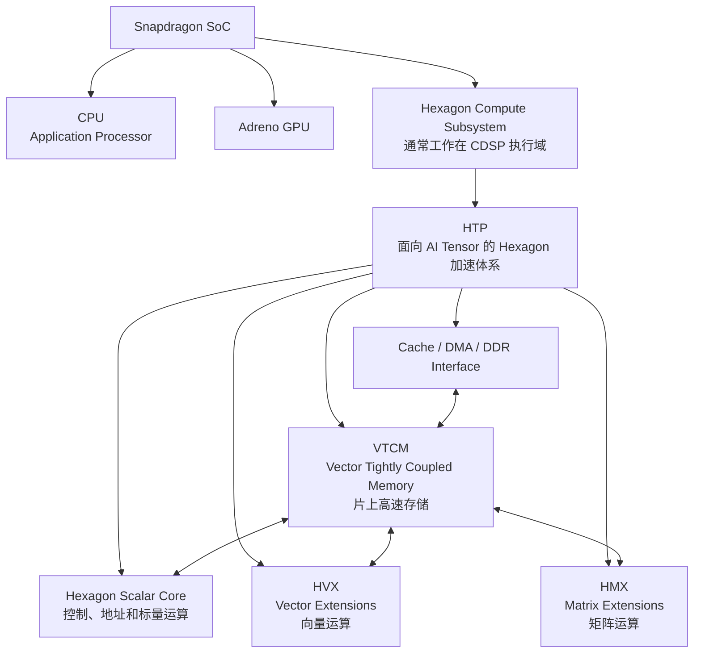
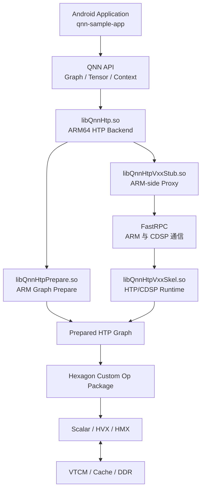
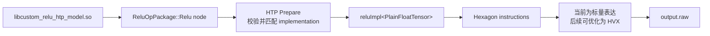
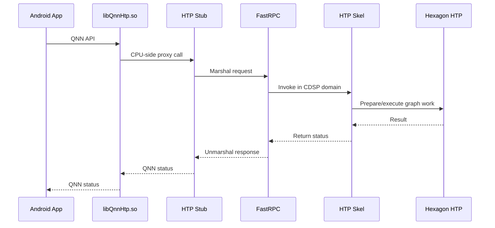

# Qualcomm Hexagon 与 HTP 架构导读

本文从 QNN 开发者的视角解释 Qualcomm Hexagon、DSP、HTP、HVX、HMX、VTCM、CDSP、FastRPC 和 QNN 之间的关系，并将这些概念映射到 Android 真机推理和 HTP Custom Op Package。

本文的重点不是芯片宣传参数，而是建立一套可以指导开发、调试和性能分析的分层模型。

## 1. 最重要的结论

先记住下面几句话：

```text
DSP     是一类处理器，不是某个软件框架。
Hexagon 是 Qualcomm 的处理器架构、指令集和计算子系统。
HTP     是面向 AI Tensor 计算的 Hexagon 硬件与运行体系。
HVX     是 Hexagon 的向量计算能力。
HMX     是 Hexagon/HTP 的矩阵计算能力。
VTCM    是 HTP 可使用的低延迟片上存储资源。
CDSP    是设备上的 Compute DSP 执行域。
FastRPC 是 ARM 应用处理器与 CDSP 之间的 RPC 通信机制。
QNN     是上层软件 API、backend 和 graph runtime。
```

因此，下面这句话不准确：

```text
Hexagon 是运行在 DSP 上的软件框架。
```

更准确的表达是：

> Hexagon 是 Qualcomm 对 DSP/AI 处理器的具体架构实现；QNN HTP Backend 是驱动该硬件执行神经网络 Graph 的软件体系。

## 2. 从应用到硬件的完整分层

这些概念横跨“处理器类别、SoC 硬件、执行域、软件 runtime”多个层级，不能全部画在同一棵硬件树中。下面分别从三个角度表示。

### 2.1 Snapdragon 中的硬件逻辑层次



这是一张开发者逻辑图，而不是某一代 Snapdragon 的晶体管级框图。不同 SoC 世代中 HTP、Hexagon core、HVX/HMX 数量、VTCM 容量和物理连接会变化。

还要注意，`DSP` 没有作为一个物理方框画在 `Hexagon` 上面，因为：

```text
DSP
  是处理器类别

Hexagon
  是 Qualcomm 对 DSP/AI 处理器的具体架构实现

HTP
  是围绕 Hexagon 架构构建的 AI Tensor 加速硬件与运行体系

HVX / HMX / VTCM
  是这个计算体系中的向量、矩阵和存储资源
```

因此“DSP -> Hexagon”表示分类和实现关系，不表示 SoC 中真的存在一个名为 DSP 的外壳模块，里面再放一个 Hexagon 模块。

### 2.2 Android/QNN 到 HTP 的软件执行路径



这个图中的组件属于不同性质：

```text
QNN API、libQnnHtp.so、Prepare、Stub、Skel
  软件组件

FastRPC
  跨处理器通信机制

CDSP
  设备执行域

Scalar、HVX、HMX、VTCM
  Hexagon/HTP 硬件计算与存储资源
```

### 2.3 当前 Relu Custom Op 的实际路径



当前 Relu 没有矩阵乘法，因此不应期待 HMX 执行它。典型资源分工是：

```text
Conv / MatMul   HMX，或 HMX 与 HVX 协作
Relu / Add      HVX，或融合进前后节点
控制和边界逻辑   Scalar
反复使用的 tile  VTCM
```

当前 `reluImpl()` 是正确性优先的 C++ 标量循环。它在 HTP/CDSP 执行体系中运行，但只有通过 HVX implementation、编译结果和 profiling 才能证明完成了有效向量化。

### 2.4 最简层次关系

```text
Snapdragon SoC
├── CPU
├── Adreno GPU
└── Hexagon Compute Subsystem / HTP
    ├── Scalar
    ├── HVX
    ├── HMX
    └── VTCM
```

这里的 `/ HTP` 表示现代 AI 开发语境下围绕 Hexagon compute subsystem 暴露的 Tensor 加速体系，不应简单理解为“HTP 是一个纯软件框架”或“Hexagon 是运行在 DSP 上的软件”。

按层次划分：

```text
应用层
  qnn-sample-app、qnn-net-run、用户 App

API 与 Graph 层
  QNN API、QnnGraph、QnnTensor、QnnContext

Backend 层
  libQnnCpu.so、libQnnGpu.so、libQnnHtp.so

Prepare 与 Runtime 层
  libQnnHtpPrepare.so、HTP Stub、HTP Skel

跨处理器通信层
  FastRPC

设备执行域
  CDSP

硬件架构层
  Hexagon Scalar、HVX、HMX、VTCM
```

调试时必须先判断问题属于哪一层。例如：

```text
找不到 libQnnHtp.so              Android 动态加载层
找不到 libQnnHtpVxxSkel.so       FastRPC/CDSP 动态加载层
Graph finalize 失败               HTP Prepare/算子支持层
Graph execute 失败                HTP Runtime/kernel 层
输出数值错误                      Tensor layout/量化/kernel 逻辑层
```

## 3. DSP 是什么

DSP 是 Digital Signal Processor，即数字信号处理器。

与通用 CPU 相比，DSP 通常更关注：

- 乘加运算。
- 向量数据处理。
- 可预测的数据访问。
- 循环和流式计算。
- 较低功耗下的持续运行。
- 音频、图像、通信、雷达和传感器等信号处理。

“DSP”是处理器类别，类似于：

```text
CPU
GPU
DSP
NPU
```

它并不特指某一款 Qualcomm 芯片，也不等同于某一个 QNN backend。

传统 DSP 擅长滤波、FFT、编解码和向量乘加，但不应由此推导出“所有 DSP 都天然适合大型神经网络矩阵计算”。现代 AI 矩阵能力通常还依赖专门的矩阵执行单元、片上内存和 graph compiler。

## 4. Hexagon 是什么

Hexagon 是 Qualcomm 的处理器架构、指令集和计算子系统品牌。

开发者能够直接观察到的 Hexagon 特征包括：

```text
hexagon-clang / hexagon-clang++
-mv68、-mv73、-mv75 等目标架构参数
QUALCOMM DSP6 ELF
QuRT 头文件和运行环境
HVX/HMX 编译选项
Hexagon SDK
```

例如本项目编译 v75 Custom Op：

```bash
hexagon-clang++ \
  -mv75 \
  -mhvx \
  -mhvx-length=128B \
  -mhmx \
  -DUSE_OS_QURT \
  ...
```

生成文件显示：

```text
ELF 32-bit LSB shared object, QUALCOMM DSP6
```

这表示文件使用 Hexagon/DSP ISA，并准备在对应的 Hexagon 执行环境加载。

### 4.1 `v75` 表示什么

`v75` 是 Hexagon 目标架构版本，不是 QNN SDK 版本，也不是 Android API level。

```text
QAIRT 2.47        软件 SDK 版本
Hexagon SDK 5.5.5 开发包版本
Hexagon Tools 8.7.06 编译器版本
Hexagon v75       目标处理器架构版本
```

这四个版本属于不同维度，不能互相替代。

## 5. HTP 是什么

QNN 文档将 HTP Backend 描述为面向 Hexagon HTP hardware accelerator 的 backend。

从开发角度，可以将 HTP 理解为：

> 建立在 Hexagon 架构之上，针对神经网络 Tensor 计算强化的硬件资源、内存体系、Graph Prepare 和执行 runtime。

HTP 不是单独的一份 `.so`，也不只是 HMX。它涉及：

```text
Hexagon 执行架构
Scalar 控制和标量计算
HVX 向量计算
HMX 矩阵计算
VTCM 片上存储
Tensor layout
量化数据表示
Graph Prepare
调度与内存规划
HTP Runtime
QNN HTP Backend
```

所以“代码运行在 HTP 上”只说明它进入了 HTP 执行体系，并不自动说明它使用了 HMX 或已经达到高性能。

## 6. Scalar、HVX、HMX 的分工

### 6.1 Scalar

Scalar 单元适合：

- 控制逻辑。
- 地址计算。
- 边界处理。
- 小规模标量运算。
- 无法向量化的代码。

当前学习版 Relu：

```cpp
for (Idx b = 0; b < in.dim(0); ++b) {
  for (Idx h = 0; h < in.dim(1); ++h) {
    for (Idx w = 0; w < in.dim(2); ++w) {
      for (Idx d = 0; d < in.dim(3); ++d) {
        out(b, h, w, d) = fmaxf(in(b, h, w, d), 0.0f);
      }
    }
  }
}
```

是一个正确性优先的标量表达。编译器可能做部分优化，但源码没有显式写出 HVX intrinsic，也没有证明最终使用了理想的 HVX kernel。

### 6.2 HVX

HVX 是 Hexagon Vector Extensions。

它适合：

- Elementwise 算子。
- 向量乘加。
- 激活函数。
- 数据重排。
- 图像和信号处理。
- 量化、反量化和 clamp。

Relu 的核心：

```text
out[i] = max(in[i], 0)
```

非常适合向量化。一条向量操作可以同时处理多个元素，从而减少循环和指令调度开销。

### 6.3 HMX

HMX 是面向矩阵/张量运算的执行能力。

它更适合：

- Matrix Multiplication。
- Convolution 中的矩阵计算部分。
- 大规模 dot product。
- 神经网络中的高密度张量运算。

Relu 通常不需要 HMX，因为它没有矩阵乘法。典型 Graph 可能表现为：

```text
MatMul/Conv -> HMX
Bias/Add    -> HVX 或融合执行
Relu        -> HVX 或融合执行
```

如果 HTP Prepare 能将后处理融合进前一个计算节点，实际执行形态可能不再对应源码中的一算子一 kernel。

## 7. VTCM 与内存层次

VTCM 的完整名称是 Vector Tightly Coupled Memory，是 cDSP/HTP 中的高性能、低延迟片上存储资源。

Hexagon SDK 5.5.5 将它描述为：

- 可供 HVX scatter/gather 使用。
- 可供支持 HMX 的设备使用。
- 可作为 HVX workload 的高速 scratch memory。
- 相比普通层次的存储更靠近计算单元，具有更高带宽和更低的 store-to-load 延迟。

可以先用下面的路径理解：

```text
DDR
  ↓ 搬入正在使用的 tile/中间数据
VTCM
  ↓ 高带宽、低延迟访问
HVX / HMX / Hexagon Scalar
```

### 7.1 VTCM 不是 Cache

AI 计算的性能不仅由计算单元决定，还由数据是否能够及时送到计算单元决定：

```text
DDR
  容量大、访问代价较高

Cache
  根据访问自动发生命中、缺失、填充和替换

VTCM
  软件/runtime 管理的片上 scratchpad，需要申请、规划和释放
```

普通 Cache 的基本行为是：

```text
访问一个内存地址
  -> 命中：直接读取 Cache line
  -> 未命中：硬件自动从下一级存储填充
```

VTCM 不依赖这种自动 Cache replacement 机制。它更接近：

```text
申请 VTCM 资源
  -> 将 tile、权重或中间数据放入 VTCM
  -> HVX/HMX 重复使用
  -> 将需要保留的结果写回 DDR
  -> 释放 VTCM
```

QNN HTP 通常由 Graph Prepare 和 runtime 完成大部分规划；更底层的 Hexagon 程序也可以通过资源管理 API 申请和释放 VTCM。

### 7.2 VTCM 与 CUDA Shared Memory 的相似点

如果熟悉 CUDA，可以使用这个近似类比：

```text
CUDA
Global Memory -> Shared Memory -> CUDA Core / Tensor Core

HTP
DDR -> VTCM -> HVX / HMX
```

共同点包括：

- 都是靠近计算单元的片上存储。
- 容量都远小于 DDR/Global Memory。
- 都适合保存反复使用的 tile 和中间结果。
- 都能减少对外部内存的重复访问。
- 都需要考虑容量、数据搬运和访问模式。
- 使用不当时，搬运开销可能大于计算收益。

因此，“VTCM 类似 HTP 世界中的 Shared Memory”可以作为第一层直觉，但不能直接画等号。

### 7.3 VTCM 与 CUDA Shared Memory 的关键区别

| 特性 | CUDA Shared Memory | Qualcomm VTCM |
| --- | --- | --- |
| 所在位置 | GPU SM 附近 | cDSP/HTP 子系统内部 |
| 主要使用者 | 一个 CUDA block 中的 threads | Hexagon threads、HVX、HMX 和 HTP Graph |
| 典型分配作用域 | 每个 thread block | Graph、context、client 或计算资源请求 |
| 典型生命周期 | 随 block 开始和结束 | 由资源管理器 acquire/release，可覆盖 Graph 执行 |
| 主要管理者 | CUDA kernel/launch configuration | HTP Prepare/runtime 或底层 Hexagon API |
| 数据搬运 | kernel 显式 load/store，或异步 copy | Prepare 插入搬运，或 runtime/kernel 显式处理 |
| 同步模型 | block 内常用 `__syncthreads()` | 没有一一对应的 CUDA block barrier 模型 |
| 资源竞争 | blocks 竞争每个 SM 的资源 | Graph、threads、PD 和其他 VTCM clients 竞争 |
| 配置粒度 | 通常是每个 block/SM 的片上容量 | QNN Graph 常以 MB 或 byte 配置/预留 |
| 抢占处理 | 由 GPU 调度模型管理 | 可能涉及 yield、backup、restore 和优先级 |

最核心的差异是作用域：

```text
CUDA Shared Memory
  通常属于一个 thread block
  block 结束后，这次分配的生命周期结束

VTCM
  是 cDSP/HTP 的共享硬件资源
  可以由不同 Graph、context、thread 或其他 client 竞争
  需要资源管理、共享、抢占、备份和恢复机制
```

CUDA Shared Memory 与 CUDA 的 block/thread 编程模型紧密绑定。VTCM 不对应一个固定的 QNN thread block；QNN 开发者通常提交 Graph，由 HTP Prepare 统一决定多个 Op 的 tile、layout、VTCM 和调度。

### 7.4 为什么 HMX 特别需要 VTCM

以矩阵乘法为例：

```text
DDR 中的大矩阵
  -> 切分 input/weight tiles
  -> 将当前 tiles 放入 VTCM
  -> HMX 对 tiles 做大量乘加
  -> 将结果写回或交给下一个 Op
```

矩阵 tile 会被重复读取。如果每次乘加都访问 DDR，HMX 可能因数据供应不足而等待。VTCM 让计算密集区域的数据保持在更靠近 HMX 的位置。

VTCM 同样可用于 HVX workload，例如：

- Elementwise 中间 Tensor。
- Layout conversion。
- Scatter/gather lookup。
- 量化和反量化中间数据。
- 多个融合算子共享的 tile。

### 7.5 QNN HTP 如何规划 VTCM

HTP `graphFinalize()` 日志中可以看到：

```text
VtcmWrapper
allocate_tcm_blocks
design_spill_fill_area
spill/fill
memory overlap
physical pointers
```

这说明 Finalize 不只是检查 Graph 语法。它还需要决定：

- Tensor 使用什么内部 layout。
- 哪些数据放入 VTCM。
- 哪些数据留在 DDR。
- tile 应该多大。
- 何时执行 DMA/spill/fill。
- VTCM block 能否复用。
- 节点按照什么顺序运行。
- 不同执行资源如何调度。

当 VTCM 不足时，Prepare/runtime 可能需要：

```text
减小 tile
让更多 Tensor 留在 DDR
增加 spill/fill
降低 Graph 并行度
等待其他 VTCM client 释放资源
```

所以 VTCM 越多不一定线性提升性能，但可用 VTCM 太少经常会增加数据搬运和调度成本。QAIRT 文档也指出 QNN 性能对可用 VTCM 数量较敏感。

### 7.6 VTCM sharing 与抢占

VTCM 是共享且有限的硬件资源。多个 Graph 或 client 并发运行时，需要考虑：

- 每个 Graph 申请的 VTCM 大小。
- 不同 Graph 是否能在 VTCM 中并排放置。
- Process Domain 是否允许共享。
- 执行优先级。
- 高优先级任务到来时是否需要 yield。
- VTCM 内容是否需要保存到 backup buffer，并在恢复时写回。

这与 CUDA 中单个 kernel 的 Shared Memory 分配不同。VTCM 资源管理已经上升到 Graph、context 和系统 client 之间的协作层。

### 7.7 对当前 Relu Custom Op 的意义

当前实现注册的是：

```cpp
reluImpl<PlainFloatTensor>
```

这并不表示输入和输出一定放在 VTCM。HTP API 中还可以看到带 `_TCM` 后缀的类型，例如：

```text
PlainFloatTensor_TCM
QuantUint8Tensor_TCM
QUint8CroutonTensor_TCM
```

如果要为某个算子提供 VTCM implementation，通常需要：

1. 注册匹配 `_TCM` Tensor 类型的 implementation。
2. 声明正确的 Tensor properties 和 constraints。
3. 必要时添加 optimization rule。
4. 让 Prepare 选择 VTCM placement，并插入 `to_vtcm/from_vtcm` 搬运。
5. 使用 profiling 验证收益是否覆盖搬运成本。

Relu 的计算量很小：

```text
读取一个元素
-> max(x, 0)
-> 写出一个元素
```

如果只为了一个独立 Relu 将 Tensor 从 DDR 搬入 VTCM，执行后再搬回 DDR，搬运成本可能高于计算收益。更合理的场景是：

- Relu 的输入本来就由前一个 VTCM kernel 产生。
- Relu 的输出马上被下一个 VTCM kernel 使用。
- Relu 被融合到 Conv/MatMul 的后处理阶段。

因此，优化目标不应是“每个算子都强制使用 VTCM”，而应是：

> 尽可能让一组可融合或连续执行的算子复用已经位于 VTCM 的数据，减少 DDR 与 VTCM 之间的往返搬运。

### 7.8 一句话总结

```text
CUDA Shared Memory
  更像一个 CUDA thread block 私有、由 kernel 显式协作使用的片上 scratchpad。

Qualcomm VTCM
  更像由 HTP Graph compiler/runtime 和资源管理器统一规划、
  供 HVX/HMX/Hexagon workloads 使用的共享片上 scratchpad。
```

两者解决的核心问题相同：让数据靠近计算单元。但它们所处的调度层级、资源作用域和软件管理模型不同。

## 8. CDSP 是什么

CDSP 可理解为 Compute DSP 执行域。Android ARM 进程不能像调用普通本地函数一样直接执行 Hexagon 指令，需要通过系统提供的 RPC 和驱动机制与 CDSP 通信。

需要区分：

```text
Hexagon
  处理器架构和指令集

CDSP
  设备上的计算执行域/子系统

HTP
  在该计算体系中面向 Tensor AI 的硬件和 runtime
```

实际产品中的物理划分和命名可能随 SoC 世代变化，开发者不应仅根据一个日志字符串推断完整微架构。

## 9. FastRPC、Stub 与 Skel

QNN HTP 在 Android 上通常跨越 ARM 与 HTP 两侧：



QAIRT 中常见库：

```text
libQnnHtp.so
  Android CPU-side HTP backend

libQnnHtpPrepare.so
  在 ARM 侧提供 Graph compose/finalize 能力

libQnnHtpV##Stub.so
  ARM 侧代理，与 HTP Skel 通过 RPC 通信

libQnnHtpV##Skel.so
  HTP/CDSP 侧 native library，作为 CPU backend 的远端代理执行

libQnnHtpV##.so
  某些平台用于不经过 RPC 的 HTP native backend
```

### 9.1 `LD_LIBRARY_PATH` 与 `ADSP_LIBRARY_PATH`

```text
LD_LIBRARY_PATH
  Android ARM dynamic linker 搜索 ARM64 库

ADSP_LIBRARY_PATH
  DSP/CDSP dynamic loader 搜索 Hexagon 库
```

这就是 HTP Custom Op 必须分开部署的原因：

```text
libQnnReluOpPackage_Cpu.so
  ARM64 ELF，放入 LD_LIBRARY_PATH 可见目录

libQnnReluOpPackage_Htp.so
  Hexagon ELF，放入 ADSP_LIBRARY_PATH 可见目录
```

如果把 Android 相对路径直接传给 HTP 侧，可能出现：

```text
4005 = QNN_BACKEND_ERROR_OP_PACKAGE_NOT_FOUND
4007 = QNN_BACKEND_ERROR_OP_PACKAGE_REGISTRATION_FAILED
```

## 10. QNN HTP Backend 做什么

`libQnnHtp.so` 是软件 backend，不是 HTP 硬件本身。

它主要负责：

- 实现 QNN backend API。
- 创建 HTP device/context/graph。
- 与 Stub/Skel 和 FastRPC 协作。
- 注册 HTP Op Package。
- 管理在线或离线 prepared context。
- 发起 Graph execute。
- 返回状态和 profiling 信息。

QNN 为不同硬件提供不同 backend：

```text
libQnnCpu.so -> CPU backend
libQnnGpu.so -> GPU backend
libQnnHtp.so -> HTP backend
```

相同的 QNN Graph 概念可以由不同 backend 实现，但每个 backend 支持的 Op、datatype、量化、layout 和性能特征不同。

## 11. Graph Prepare 与 Graph Execute

### 11.1 Prepare

Prepare 发生在 `graphFinalize()` 或离线 context 生成阶段。

它可能包括：

- Op 支持与约束检查。
- Custom Op implementation 匹配。
- 常量处理。
- Tensor layout 选择。
- 量化信息处理。
- Graph rewrite 和 fusion。
- HMX/HVX 等资源选择。
- VTCM 和 DDR 内存规划。
- DMA、spill/fill 和执行顺序规划。
- 生成 prepared graph/runlist。

因此：

```text
Graph finalize 成功
```

表示 Graph 已经被 HTP 接受并完成准备，但还不能证明 kernel 数值正确。

### 11.2 Execute

`QnnGraph_execute()` 负责：

- 绑定输入输出 buffer。
- 将执行请求发送到 HTP/CDSP。
- 执行 prepared runlist。
- 调用选中的 builtin/custom implementation。
- 同步结果和状态。

最终还需要比较输出数据，才能证明算子正确。

## 12. HTP 与 DSP Backend 的区别

HTP 和 DSP 都可能使用 Hexagon 架构，但 QNN 中是不同 backend：

| 项目 | DSP Backend | HTP Backend |
| --- | --- | --- |
| 定位 | 通用 DSP/信号处理 | 神经网络 Tensor 加速 |
| 典型 host library | `libQnnDsp.so` | `libQnnHtp.so` |
| Graph 优化重点 | 通用 DSP execution | Tensor layout、量化、融合、VTCM、AI 调度 |
| Custom Op 模板 | DSP Op Package | HTP Op Package/QHPI |
| Kernel API | DSP backend-specific API | HTP Core Tensor API 或 QHPI |
| 可否直接混用 `.so` | 否 | 否 |

即使两份库都显示 `QUALCOMM DSP6`，也不代表 ABI 和 runtime 相同。

```text
相同 ISA
≠ 相同 Backend
≠ 相同 Op Package ABI
≠ 可以互相加载
```

## 13. HTP 与 GPU 的区别

GPU 能做向量和神经网络计算，高通并没有禁止 GPU 执行 AI。QNN 同样提供 GPU backend。

二者取舍主要是：

| 维度 | GPU | HTP |
| --- | --- | --- |
| 设计目标 | 图形与通用并行计算 | 移动 AI Tensor 计算 |
| 编程模型 | 大量并行线程/work item | Graph Prepare + Tensor implementation |
| 典型优势 | 灵活浮点并行、图形协同 | 量化、能效、持续推理、AI layout |
| 矩阵单元 | GPU 架构相关 | HMX |
| 向量单元 | GPU ALU/SIMD/SIMT | HVX |
| 片上存储 | GPU cache/shared/local memory | VTCM/cache |
| 系统竞争 | 可能与图形渲染共享资源 | 独立 HTP/CDSP 执行体系 |

移动端选择 HTP 的常见原因：

- 更高的神经网络性能功耗比。
- 对 INT8/INT16/FP16 和量化 Graph 的专门支持。
- 降低长期占用 GPU 对 UI/游戏/相机渲染的影响。
- 更适合持续运行的相机、语音和端侧 AI。
- Graph Prepare 可以针对 HTP 的 layout、VTCM、HVX/HMX 做整体优化。

但具体模型是否更适合 HTP，仍取决于：

```text
Op 支持情况
精度和量化方式
Tensor shape
模型规模
内存带宽
延迟目标
功耗目标
GPU/HTP 当前负载
```

## 14. 与 NVIDIA CUDA 的对应关系

这只是帮助理解的近似映射，不表示两套架构完全等价：

| NVIDIA/CUDA | Qualcomm/QNN HTP |
| --- | --- |
| NVIDIA GPU architecture | Qualcomm Hexagon architecture |
| CUDA Runtime/API | QNN API + HTP Backend/Runtime |
| CUDA kernel | HTP implementation/Custom Op kernel |
| CUDA Core/warp execution | Hexagon Scalar/HVX execution |
| Tensor Core | HMX |
| Shared Memory | VTCM，概念近似但管理方式不同 |
| CUDA Grid/Block/Thread | QNN Graph/Op/Tensor，不是直接一一对应 |
| Kernel launch | `QnnGraph_execute()` 中执行 prepared graph |

CUDA 通常把并行层次显式暴露给程序员：

```text
grid
block
thread
warp
shared memory
```

QNN HTP 更强调 Graph 编译和 backend 决策：

```text
Graph
Tensor
Op implementation
constraints
cost
layout
Prepare
```

HTP Custom Op 开发者仍需要理解底层向量、矩阵和内存，但不会完全照搬 CUDA thread indexing 模型。

## 15. HTP Custom Op 如何映射到硬件

本项目的自定义 Relu 注册：

```cpp
DEF_PACKAGE_OP((reluImpl<Tensor>), "Relu")

DEF_PACKAGE_OP_AND_COST_AND_FLAGS(
    (reluImpl<PlainFloatTensor>), "Relu", SNAIL)
```

运行流程：

```text
QNN node
  packageName = ReluOpPackage
  typeName    = Relu
       ↓
ARM Prepare Package
  ValidateOpConfig
       ↓
HTP Prepare
  根据 tensor type/layout/cost 匹配 implementation
       ↓
Prepared Graph
       ↓
HTP Execute
  reluImpl<PlainFloatTensor>()
       ↓
Hexagon 指令
       ↓
Scalar/HVX 等实际执行资源
```

注意：

```text
注册 Flags::RESOURCE_HVX
≠ kernel 已经高效向量化

使用 HTP Backend
≠ 每个 Op 都使用 HMX

编译参数包含 -mhmx
≠ 普通 C++ 循环自动变成 HMX 矩阵 kernel
```

要证明实际使用情况，需要结合：

- 编译器输出或反汇编。
- HTP profiling。
- 不同实现的性能对比。
- HTP 调试日志。
- Tensor layout 和 resource registration。

## 16. 在线 Prepare 与离线 Prepare

### 16.1 在线 Prepare

```text
手机加载 model.so
  -> QnnModel_composeGraphs()
  -> graphFinalize()
  -> ARM 上的 libQnnHtpPrepare.so 准备 Graph
  -> HTP 执行
```

本项目的 HTP Custom Relu 使用在线 Prepare，因此需要：

```text
ARM64 Custom Op Package
Hexagon Custom Op Package
libQnnHtpPrepare.so
model.so
```

### 16.2 离线 Prepare

```text
Host 上生成 serialized context binary
  -> 手机直接 retrieve_context
  -> 减少目标设备上的 Graph Prepare 工作
```

离线 prepared context 仍可能需要设备侧 Custom Op Package，具体取决于 Package、context 内容和执行方式，不能因为已有 `.bin` 就默认所有自定义执行代码都被嵌入。

## 17. 为什么 Custom Op 有 ARM 和 Hexagon 两份库

同一份 HTP Op Package 源码会生成：

```text
ARM64 package
  Android CPU 可执行
  服务在线 Prepare 和 CPU target 注册

Hexagon package
  CDSP/HTP 可执行
  包含真正的 HTP kernel implementation
```

调用时：

```text
libQnnReluOpPackage_Cpu.so:ReluOpPackageInterfaceProvider:CPU
libQnnReluOpPackage_Htp.so:ReluOpPackageInterfaceProvider:HTP
```

这里的 `CPU` 不表示模型改由 CPU backend 推理，而表示这份 Package 是 HTP 流程中的 ARM Prepare 版本。

## 18. 常见概念误区

### 误区一：Hexagon 是软件框架

错误。Hexagon 是处理器架构、ISA 和计算子系统；QNN 才是软件框架/API。

### 误区二：HTP 就是一颗完全独立的传统 DSP

不够准确。HTP 是面向 Tensor AI 的 Hexagon accelerator/runtime 体系，涉及 Scalar、HVX、HMX、VTCM 和 Graph Prepare。

### 误区三：所有 DSP 都擅长神经网络矩阵乘法

错误。矩阵 AI 性能依赖专用矩阵单元、数据类型、内存层次和编译器。HTP 中的 HMX 才是关键矩阵能力之一。

### 误区四：GPU 不能运行 Qualcomm AI 模型

错误。QNN 有 GPU backend。HTP 经常因能效、量化和持续运行表现被选择，但不是唯一选择。

### 误区五：运行在 HTP 就自动使用 HMX

错误。Elementwise Relu 通常更适合 HVX；控制和边界逻辑可能运行在 Scalar；MatMul/Conv 才更可能使用 HMX。

### 误区六：Hexagon ELF 可以在 Android ARM 进程中直接 `dlopen`

错误。ARM64 与 Hexagon 是不同 ISA。Hexagon library 由 CDSP/HTP 侧加载，通常通过 FastRPC 和 `ADSP_LIBRARY_PATH` 协作。

### 误区七：HTP Op Package 与 DSP Op Package 可以互换

错误。即使都编译为 QUALCOMM DSP6 ELF，它们属于不同 backend ABI 和 runtime。

## 19. 如何读 HTP 日志

以下日志对应不同层：

```text
Backend build version
  ARM 上成功加载 libQnnHtp.so

First connection to QNN stub established
  ARM backend 与 HTP Stub 建立连接

Initializing HtpProvider
  HTP provider 初始化

PrepareLibLoader Loading libQnnHtpPrepare.so
  开始使用 ARM 在线 Prepare

Loaded package ..._Cpu.so
  ARM Prepare Package 加载成功

Registered Op Package ..._Htp.so
  HTP target Package 注册请求成功

QnnContext_create done successfully
  Context 和远端注册链路成功

QnnGraph_finalize started
  开始 layout、优化、内存与调度准备

VXU ... Num HVX threads / Num HMX threads
  Runtime 报告可用执行资源

allocate_tcm_blocks / VtcmWrapper
  进行 VTCM 资源规划

QnnGraph_finalize done
  Prepared Graph 生成成功

Graph ... execution finished with result 0
  HTP 执行完成
```

## 20. 面向 Custom Op 的学习路线

### 阶段一：建立正确性

```text
理解 QNN Graph/Tensor/Op
理解 PackageName + TypeName
写 FLOAT32 标量 kernel
完成 ARM/Hexagon 双库编译
真机执行并与 NumPy 对比
```

### 阶段二：理解 HTP Tensor

```text
PlainFloatTensor
QuantUint8Tensor
Crouton layout
TCM variant
interface scale/offset
rank backfill
```

### 阶段三：理解 Prepare

```text
implementation matching
constraints
cost
tensor properties
parameter order
optimization rule
fusion
```

### 阶段四：性能优化

```text
HVX vectorization
数据对齐
连续内存访问
减少 layout conversion
VTCM 使用
DMA/spill/fill
profiling
```

### 阶段五：矩阵算子

```text
MatMul/Conv 数据布局
HMX 适用条件
量化 accumulator
tile/block 策略
权重预处理
```

## 21. 与本项目其他文档的关系

```text
architecture/qualcomm_hexagon_htp.md
  解释硬件、运行时和 QNN 分层

custom_op_packages/relu_custom_op_package_cpu.md
  CPU Custom Op Package 完整实践

custom_op_packages/relu_custom_op_package_htp.md
  HTP Custom Op Package、双库和 kernel 完整实践

examples/SampleApp.md
  QNN SampleApp 基础执行流程

examples/SampleAppSharedBuffer.md
  Shared Buffer 与 memRegister
```

建议阅读顺序：

```text
SampleApp
  -> 本文
  -> CPU Custom Op
  -> HTP Custom Op
  -> HTP profiling/HVX optimization
```

## 22. SDK 内参考资料

本文结合当前 QAIRT 2.47 SDK 中的以下资料整理：

```text
$QAIRT_SDK_ROOT/docs/QAIRT-Docs/QNN/general/backend.html
$QAIRT_SDK_ROOT/docs/QAIRT-Docs/QNN/general/htp/htp_backend.html
$QAIRT_SDK_ROOT/docs/QAIRT-Docs/QNN/general/dsp/dsp_backend.html
$QAIRT_SDK_ROOT/docs/QAIRT-Docs/QNN/general/tutorial3.html
$QAIRT_SDK_ROOT/docs/QAIRT-Docs/QNN/general/op_package_gen_example.html
$QAIRT_SDK_ROOT/examples/QNN/OpPackage/HTP
$QAIRT_SDK_ROOT/include/QNN/HTP
```

不同 Snapdragon 平台、Hexagon 架构和 QAIRT 版本的库名、支持能力与约束可能变化。实际开发时，应以目标版本 SDK 的 backend 文档、OpDef supplement、生成 Makefile 和设备日志为准。

## 23. 总结

```text
DSP
  处理器类别

Hexagon
  Qualcomm 的 DSP/AI 处理器架构和指令集

HTP
  面向 AI Tensor 的 Hexagon 硬件与运行体系

HVX
  向量执行能力

HMX
  矩阵执行能力

VTCM
  HTP 低延迟片上存储资源

CDSP
  设备上的 Compute DSP 执行域

FastRPC
  ARM 与 CDSP 之间的调用通道

QNN
  组织 Graph、选择 Backend、Prepare 和 Execute 的软件 API/runtime
```

最终应形成的心智模型是：

> Android 应用通过 QNN HTP Backend 描述并准备 Graph，经 Stub/FastRPC/Skel 将工作提交到 CDSP 中的 Hexagon HTP 执行体系，再由 Prepare 后选定的 Scalar、HVX、HMX implementation 和内存规划完成实际计算。
