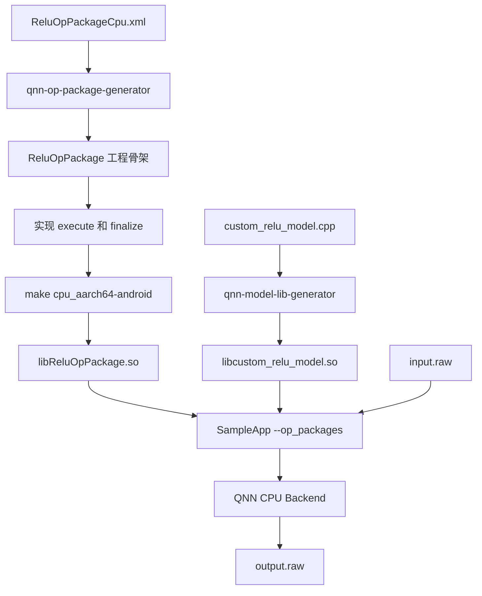
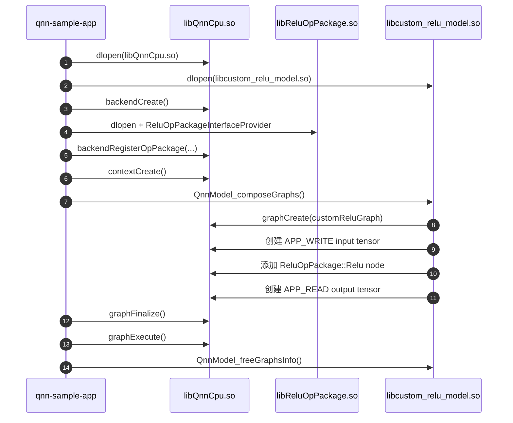

# QNN Custom Op Package 从生成到真机执行

本文记录在 QAIRT/QNN SDK 2.47 中实现一个 CPU 自定义 Relu 算子，并通过 Android 手机上的 QNN CPU backend 执行的完整流程。

当前实验环境：

```text
QAIRT SDK : /home/lingbok/Qualcomm/qairt/2.47.0.260601
Android NDK: /home/lingbok/android/android-ndk-r28
Host       : Linux x86_64
Target     : Android arm64
Phone dir  : /data/local/tmp/qnn
Backend    : libQnnCpu.so
```

实验最终得到两个动态库：

```text
libReluOpPackage.so
  自定义算子的注册、校验和 CPU kernel

libcustom_relu_model.so
  包含一个调用 ReluOpPackage::Relu 的测试 Graph
```

## 1. 整体链路



运行时的关键调用关系：

```text
SampleApp
  -> backendRegisterOpPackage(libReluOpPackage.so, ReluOpPackageInterfaceProvider)
  -> contextCreate()
  -> QnnModel_composeGraphs()
  -> graphCreate()
  -> 创建 ReluOpPackage::Relu node
  -> graphFinalize()
       -> validateOpConfig()
       -> populateFromNode()
       -> finalize()
  -> graphExecute()
       -> execute()
  -> free()
```

## 2. Op Package 是什么

QNN Graph 中的每个 node 至少包含：

```text
nodeName
packageName
typeName
inputs
outputs
params
```

QNN 内置 Relu 通常使用：

```text
packageName = qti.aisw
typeName    = Relu
```

本实验的自定义 Relu 使用：

```text
packageName = ReluOpPackage
typeName    = Relu
```

虽然两个算子都叫 `Relu`，但 package name 不同，因此它们是不同的算子实现。

Op Package 的职责包括：

- 向 QNN backend 声明 Package 名和支持的算子。
- 校验 node 配置、输入输出和参数。
- 为 node 创建 backend-specific 实现。
- 在 `graphExecute()` 时执行 kernel。
- 释放自定义算子状态。

## 3. Python 环境

QAIRT 2.47 中的 Python 扩展依赖 Python 3.12。已有的 `qai_hub` 环境使用 Python 3.10，不能直接用于这套工具。

查看 Conda 环境：

```bash
conda env list
```

创建专用环境：

```bash
conda create -n qairt-2.47 python=3.12
conda activate qairt-2.47
```

安装本次生成器实际需要的依赖：

```bash
conda install numpy lxml mako
```

配置 SDK：

```bash
export QAIRT_SDK_ROOT=/home/lingbok/Qualcomm/qairt/2.47.0.260601
export QNN_SDK_ROOT="$QAIRT_SDK_ROOT"
export ANDROID_NDK_ROOT=/home/lingbok/android/android-ndk-r28

export PYTHONPATH="$QAIRT_SDK_ROOT/lib/python"
export LD_LIBRARY_PATH="$CONDA_PREFIX/lib:$QAIRT_SDK_ROOT/lib/x86_64-linux-clang:$LD_LIBRARY_PATH"
export PATH="$QAIRT_SDK_ROOT/bin/x86_64-linux-clang:$ANDROID_NDK_ROOT:$PATH"
unset PYTHONHOME
```

这里同时设置 `QAIRT_SDK_ROOT` 和 `QNN_SDK_ROOT`，因为新工具主要使用前者，而生成的部分 Makefile 仍检查后者。

验证：

```bash
python3 --version
qnn-op-package-generator --help
qnn-model-lib-generator --help
```

## 4. SDK 中的官方示例

相关目录：

```text
$QAIRT_SDK_ROOT/examples/QNN/OpPackage/CPU
$QAIRT_SDK_ROOT/examples/QNN/OpPackage/DSP
$QAIRT_SDK_ROOT/examples/QNN/OpPackage/GPU
$QAIRT_SDK_ROOT/examples/QNN/OpPackage/HTP
$QAIRT_SDK_ROOT/examples/QNN/OpPackageGenerator
```

本实验使用的 XML 模板：

```text
$QAIRT_SDK_ROOT/examples/QNN/OpPackageGenerator/ReluOpPackageCpu.xml
```

## 5. Relu Op 定义

官方 XML 中的核心结构：

```xml
<OpDefCollection
        PackageName="ReluOpPackage"
        Domain="aisw"
        Version="1.0">
    <OpDefList>
        <OpDef>
            <Name>Relu</Name>
            <Input>
                <Name>in[0]</Name>
                <Mandatory>true</Mandatory>
                <Datatype>BACKEND_SPECIFIC</Datatype>
                <Shape>
                    <Rank>ND</Rank>
                </Shape>
            </Input>
            <Output>
                <Name>out[0]</Name>
                <Mandatory>true</Mandatory>
                <Datatype>BACKEND_SPECIFIC</Datatype>
                <Shape>
                    <Rank>ND</Rank>
                </Shape>
            </Output>
            <SupportedBackend>CPU</SupportedBackend>
        </OpDef>
    </OpDefList>

    <SupplementalOpDefList Backend="CPU">
        <SupportedOps>
            <OpName>Relu</OpName>
        </SupportedOps>
        <SupplementalOpDef>
            <Name>Relu</Name>
            <Input>
                <Name>in[0]</Name>
                <Datatype>QNN_DATATYPE_FLOAT_32</Datatype>
            </Input>
            <Output>
                <Name>out[0]</Name>
                <Datatype>QNN_DATATYPE_FLOAT_32</Datatype>
            </Output>
        </SupplementalOpDef>
    </SupplementalOpDefList>
</OpDefCollection>
```

本实验的 kernel 只实现 `float32`。官方 XML 还列出了 `QNN_DATATYPE_UFIXED_POINT_16`，正式项目应从自有 XML 中删除未实现的数据类型，或者补齐对应 kernel，避免 Package 声明能力和真实实现不一致。

## 6. 生成 Op Package 工程

建立实验目录：

```bash
mkdir -p ~/qnn_custom_op_lab
cd ~/qnn_custom_op_lab
```

生成：

```bash
qnn-op-package-generator \
  --config_path "$QAIRT_SDK_ROOT/examples/QNN/OpPackageGenerator/ReluOpPackageCpu.xml" \
  --output_path "$HOME/qnn_custom_op_lab/generated" \
  --debug
```

生成结果：

```text
generated/ReluOpPackage/
├── Makefile
├── config/
│   └── ReluOpPackageCpu.xml
├── makefiles/
├── src/
│   ├── CpuCustomOpPackage.cpp
│   ├── ReluOpPackageInterface.cpp
│   ├── ops/
│   │   └── Relu.cpp
│   └── utils/
└── include/
```

建议立即建立 Git 基线：

```bash
cd ~/qnn_custom_op_lab
git init
git add generated/ReluOpPackage
git commit -m "Generate CPU Relu op package skeleton"
```

不要把后续生成的 `libs/`、`obj/` 和临时目录提交到 Git。

## 7. 生成代码的职责

### `ReluOpPackageInterface.cpp`

导出 Package provider：

```text
ReluOpPackageInterfaceProvider
```

SampleApp 通过该符号取得 `QnnOpPackage_Interface_t`，其中包含：

```text
init
terminate
getInfo
validateOpConfig
createOpImpl
freeOpImpl
logInitialize
logSetLevel
logTerminate
```

### `CpuCustomOpPackage.cpp`

管理 Package 名、算子列表、Package 初始化和算子实现对象。

### `src/ops/Relu.cpp`

包含自定义 Relu 的生命周期函数：

| 函数 | 调用阶段 | 职责 |
| --- | --- | --- |
| `validateOpConfig` | node 创建/校验 | 检查 type、输入输出数量 |
| `populateFromNode` | 创建实现对象 | 保存 input/output tensor |
| `finalize` | graph finalize | 检查类型、rank 和元素数量 |
| `execute` | 每次推理 | 执行 Relu kernel |
| `free` | graph/context 释放 | 释放自定义状态 |

## 8. 实现 CPU Relu Kernel

在 `src/ops/Relu.cpp` 中增加：

```cpp
#include <algorithm>
```

`execute()`：

```cpp
Qnn_ErrorHandle_t execute(CustomOp* operation) {
  QNN_CUSTOM_BE_ENSURE(operation != nullptr, QNN_OP_PACKAGE_ERROR_INVALID_ARGUMENT)

  auto input  = operation->getInput(0);
  auto output = operation->getOutput(0);

  QNN_CUSTOM_BE_ENSURE(input != nullptr, QNN_OP_PACKAGE_ERROR_INVALID_ARGUMENT)
  QNN_CUSTOM_BE_ENSURE(output != nullptr, QNN_OP_PACKAGE_ERROR_INVALID_ARGUMENT)
  QNN_CUSTOM_BE_ENSURE_EQ(input->dataType,
                          QNN_CPU_DATATYPE_FLOAT_32,
                          QNN_OP_PACKAGE_ERROR_VALIDATION_FAILURE)
  QNN_CUSTOM_BE_ENSURE_EQ(output->dataType,
                          QNN_CPU_DATATYPE_FLOAT_32,
                          QNN_OP_PACKAGE_ERROR_VALIDATION_FAILURE)

  const auto* inputData = static_cast<const float*>(input->data);
  auto* outputData      = static_cast<float*>(output->data);

  QNN_CUSTOM_BE_ENSURE(inputData != nullptr, QNN_OP_PACKAGE_ERROR_INVALID_ARGUMENT)
  QNN_CUSTOM_BE_ENSURE(outputData != nullptr, QNN_OP_PACKAGE_ERROR_INVALID_ARGUMENT)

  const uint32_t elementCount = numTensorSize(input);
  for (uint32_t i = 0; i < elementCount; ++i) {
    outputData[i] = std::max(inputData[i], 0.0f);
  }

  return QNN_SUCCESS;
}
```

`finalize()`：

```cpp
Qnn_ErrorHandle_t finalize(const CustomOp* operation) {
  QNN_CUSTOM_BE_ENSURE(operation != nullptr, QNN_OP_PACKAGE_ERROR_INVALID_ARGUMENT)
  QNN_CUSTOM_BE_ENSURE_EQ(operation->numInput(), 1,
                          QNN_OP_PACKAGE_ERROR_VALIDATION_FAILURE)
  QNN_CUSTOM_BE_ENSURE_EQ(operation->numOutput(), 1,
                          QNN_OP_PACKAGE_ERROR_VALIDATION_FAILURE)

  auto input  = operation->getInput(0);
  auto output = operation->getOutput(0);

  QNN_CUSTOM_BE_ENSURE(input != nullptr, QNN_OP_PACKAGE_ERROR_INVALID_ARGUMENT)
  QNN_CUSTOM_BE_ENSURE(output != nullptr, QNN_OP_PACKAGE_ERROR_INVALID_ARGUMENT)
  QNN_CUSTOM_BE_ENSURE_EQ(input->dataType,
                          QNN_CPU_DATATYPE_FLOAT_32,
                          QNN_OP_PACKAGE_ERROR_VALIDATION_FAILURE)
  QNN_CUSTOM_BE_ENSURE_EQ(output->dataType,
                          QNN_CPU_DATATYPE_FLOAT_32,
                          QNN_OP_PACKAGE_ERROR_VALIDATION_FAILURE)
  QNN_CUSTOM_BE_ENSURE_EQ(input->rank, output->rank,
                          QNN_OP_PACKAGE_ERROR_VALIDATION_FAILURE)
  QNN_CUSTOM_BE_ENSURE_EQ(numTensorSize(input), numTensorSize(output),
                          QNN_OP_PACKAGE_ERROR_VALIDATION_FAILURE)

  return QNN_SUCCESS;
}
```

`execute()` 是推理热路径，不应进行 `malloc`、`new` 或动态扩容的 STL 操作。固定不变的数据应在 `finalize()` 阶段准备，并由 `free()` 释放。

## 9. 编译 Android Op Package

设置构建环境：

```bash
export QAIRT_SDK_ROOT=/home/lingbok/Qualcomm/qairt/2.47.0.260601
export QNN_SDK_ROOT="$QAIRT_SDK_ROOT"
export ANDROID_NDK_ROOT=/home/lingbok/android/android-ndk-r28
```

编译 Android arm64：

```bash
cd ~/qnn_custom_op_lab/generated/ReluOpPackage
make cpu_aarch64-android
```

成功日志包含：

```text
Compile++      : ReluOpPackage <= Relu.cpp
SharedLibrary  : libReluOpPackage.so
Install        : libReluOpPackage.so => libs/arm64-v8a/libReluOpPackage.so
```

如果最后因 PATH 中包含字面量 `~/anaconda3/bin` 导致 `find -execdir` 失败，C++ 编译实际已经完成。手动整理目录：

```bash
mv libs/arm64-v8a libs/aarch64-android
```

检查产物和接口符号：

```bash
file libs/aarch64-android/libReluOpPackage.so

readelf -Ws libs/aarch64-android/libReluOpPackage.so \
  | grep ReluOpPackageInterfaceProvider
```

预期目录：

```text
libs/aarch64-android/
├── libReluOpPackage.so
└── libc++_shared.so
```

## 10. 构造测试 Graph

普通模型中的内置 Relu 不会自动调用自定义 Package。必须创建一个 node，明确指定：

```text
packageName = ReluOpPackage
typeName    = Relu
```

### 10.1 为什么还需要 model library

Op Package 只定义“算子如何计算”，并不定义一个完整的 Graph。仅有
`libReluOpPackage.so` 时，QNN 仍然不知道：

- Graph 有几个输入和输出。
- tensor 的名称、shape 和数据类型是什么。
- Graph 中有哪些 node。
- node 之间如何连接。
- 哪个 node 应使用这个自定义 Package。

这几部分的分工是：

```text
libReluOpPackage.so
  定义 ReluOpPackage::Relu 怎样计算

libcustom_relu_model.so
  定义 input -> ReluOpPackage::Relu -> output 这个 Graph

libQnnCpu.so
  提供 CPU backend，管理并执行 Graph

qnn-sample-app
  加载上述动态库、读取 raw 输入、执行 Graph、保存输出
```

因此 `custom_relu_model.cpp` 不是另一份 kernel，而是一个 QNN Graph 构造程序。
它经过 `qnn-model-lib-generator` 编译为 model library，随后由 SampleApp 通过
`dlopen()` 加载。

运行时基本流程：

```text
qnn-sample-app
    -> dlopen(libQnnCpu.so)
    -> dlopen(libcustom_relu_model.so)
    -> backendCreate()
    -> dlopen(libReluOpPackage.so)
    -> backendRegisterOpPackage()
    -> contextCreate()
    -> QnnModel_composeGraphs()
         -> 创建 customReluGraph
         -> 创建 APP_WRITE input tensor
         -> 创建 ReluOpPackage::Relu node
         -> 创建 APP_READ output tensor
    -> graphFinalize()
         -> 自定义算子的 validate/finalize
    -> graphExecute()
         -> 自定义算子的 execute
    -> 读取并保存 output tensor
    -> QnnModel_freeGraphsInfo()
    -> contextFree()
    -> backendFree()
```

其中 `dlopen()` 只是把动态库和导出符号加载进进程；真正创建自定义 node 的动作发生在
`QnnModel_composeGraphs()` 中。Op Package 必须在 compose/finalize 自定义 node 前注册到
backend。



创建：

```text
~/qnn_custom_op_lab/model/custom_relu_model.cpp
```

测试 Graph：

```text
input: float32[1,4], APP_WRITE
  -> ReluOpPackage::Relu
output: float32[1,4], APP_READ
```

完整的 `custom_relu_model.cpp`：

```cpp
#include "QnnModel.hpp"

using namespace qnn_wrapper_api;

extern "C" {
QNN_API
ModelError_t QnnModel_composeGraphs(Qnn_BackendHandle_t backendHandle,
                                    QNN_INTERFACE_VER_TYPE interface,
                                    Qnn_ContextHandle_t contextHandle,
                                    const GraphConfigInfo_t** graphsConfigInfo,
                                    const uint32_t numGraphsConfigInfo,
                                    GraphInfoPtr_t** graphsInfo,
                                    uint32_t* numGraphsInfo,
                                    bool debug,
                                    QnnLog_Callback_t logCallback,
                                    QnnLog_Level_t maxLogLevel) {
  ModelError_t err = MODEL_NO_ERROR;

  QnnModel customReluModel;
  const QnnGraph_Config_t** graphConfigs = nullptr;
  VALIDATE(getQnnGraphConfigFromInfo(
               "customReluGraph", graphsConfigInfo, numGraphsConfigInfo, graphConfigs),
           err);
  VALIDATE(customReluModel.initialize(backendHandle,
                                     interface,
                                     contextHandle,
                                     "customReluGraph",
                                     debug,
                                     true,
                                     graphConfigs),
           err);

  uint32_t inputDimensions[] = {1, 4};
  VALIDATE(customReluModel.addTensor(
               "input",
               (Qnn_Tensor_t){
                   .version = QNN_TENSOR_VERSION_1,
                   .v1      = {.id             = 0,
                          .name           = "input",
                          .type           = QNN_TENSOR_TYPE_APP_WRITE,
                          .dataFormat     = QNN_TENSOR_DATA_FORMAT_FLAT_BUFFER,
                          .dataType       = QNN_DATATYPE_FLOAT_32,
                          .quantizeParams = {QNN_DEFINITION_UNDEFINED,
                                             QNN_QUANTIZATION_ENCODING_UNDEFINED,
                                             {.scaleOffsetEncoding = {.scale = 0.0f, .offset = 0}}},
                          .rank           = 2,
                          .dimensions     = inputDimensions,
                          .memType        = QNN_TENSORMEMTYPE_RAW,
                          .clientBuf      = {.data = nullptr, .dataSize = 0}}}),
           err);

  const char* inputNames[] = {"input"};
  uint32_t outputDimensions[] = {1, 4};
  Qnn_Tensor_t outputs[]      = {(Qnn_Tensor_t){
      .version = QNN_TENSOR_VERSION_1,
      .v1      = {.id             = 0,
             .name           = "output",
             .type           = QNN_TENSOR_TYPE_APP_READ,
             .dataFormat     = QNN_TENSOR_DATA_FORMAT_FLAT_BUFFER,
             .dataType       = QNN_DATATYPE_FLOAT_32,
             .quantizeParams = {QNN_DEFINITION_UNDEFINED,
                                QNN_QUANTIZATION_ENCODING_UNDEFINED,
                                {.scaleOffsetEncoding = {.scale = 0.0f, .offset = 0}}},
             .rank           = 2,
             .dimensions     = outputDimensions,
             .memType        = QNN_TENSORMEMTYPE_RAW,
             .clientBuf      = {.data = nullptr, .dataSize = 0}}}};

  VALIDATE(customReluModel.addNode(QNN_OPCONFIG_VERSION_1,
                                   "CustomRelu_0",
                                   "ReluOpPackage",
                                   "Relu",
                                   nullptr,
                                   0,
                                   inputNames,
                                   1,
                                   outputs,
                                   1),
           err);

  QnnModel* models[] = {&customReluModel};
  const uint32_t numModels = 1;
  VALIDATE(getGraphInfoFromModels(*models, numModels, graphsInfo), err);
  *numGraphsInfo = numModels;

  return err;
}

QNN_API
ModelError_t QnnModel_freeGraphsInfo(GraphInfoPtr_t** graphs, uint32_t numGraphsInfo) {
  return qnn_wrapper_api::freeGraphsInfo(graphs, numGraphsInfo);
}
}
```

### 10.2 `custom_relu_model.cpp` 的关键部分

#### 固定导出接口

model library 必须使用 `extern "C"` 导出：

```text
QnnModel_composeGraphs
QnnModel_freeGraphsInfo
```

SampleApp 使用固定符号名通过 `dlsym()` 查找它们。`extern "C"` 用于避免 C++
name mangling。如果缺少 `QnnModel_freeGraphsInfo`，会出现：

```text
undefined symbol: QnnModel_freeGraphsInfo
```

#### 创建 Graph

```cpp
QnnModel customReluModel;

customReluModel.initialize(
    backendHandle,
    interface,
    contextHandle,
    "customReluGraph",
    debug,
    true,
    graphConfigs);
```

`backendHandle`、QNN API `interface` 和 `contextHandle` 都由 SampleApp 创建后传入。
model library 只负责在这个 Context 中构造 Graph。

#### 输入 tensor

```text
name     = input
type     = QNN_TENSOR_TYPE_APP_WRITE
datatype = QNN_DATATYPE_FLOAT_32
shape    = [1, 4]
```

`APP_WRITE` 表示数据由应用写入。它与 `input_list.txt` 中的名称对应：

```text
input:=/data/local/tmp/qnn/custom_relu/input/input.raw
```

compose Graph 时 `clientBuf.data` 可以是 `nullptr`，因为真正的执行 buffer 会在
SampleApp 的 `executeGraphs()` 阶段分配和填充。

#### 输出 tensor

```text
name     = output
type     = QNN_TENSOR_TYPE_APP_READ
datatype = QNN_DATATYPE_FLOAT_32
shape    = [1, 4]
```

`APP_READ` 表示执行完成后应用需要读取这个 tensor。SampleApp 因此会将其保存为
`output.raw`。

#### 添加自定义 node

```cpp
customReluModel.addNode(
    QNN_OPCONFIG_VERSION_1,
    "CustomRelu_0",
    "ReluOpPackage",
    "Relu",
    nullptr,
    0,
    inputNames,
    1,
    outputs,
    1);
```

参数含义：

| 参数 | 本例 | 含义 |
| --- | --- | --- |
| node name | `CustomRelu_0` | Graph 内的 node 实例名 |
| package name | `ReluOpPackage` | 去哪个已注册 Package 查找实现 |
| type name | `Relu` | 使用 Package 中的哪个 operator |
| params | `nullptr, 0` | 本例没有算子参数 |
| inputs | `inputNames, 1` | 一个名为 `input` 的输入 |
| outputs | `outputs, 1` | 一个名为 `output` 的输出 |

其中 `packageName + typeName` 是选择自定义实现的关键：

```text
ReluOpPackage + Relu
  -> REGISTER_OP(Relu, register_ReluCustomOp)
  -> finalize()
  -> execute()
```

如果 package name 写成 `qti.aisw`，Graph 使用的将是 QNN 内置 Relu，而不是本实验的
自定义实现。

#### 返回和释放 Graph metadata

```cpp
getGraphInfoFromModels(*models, numModels, graphsInfo);
*numGraphsInfo = numModels;
```

这一步把 Graph handle、Graph 名称和 input/output tensor metadata 返回给 SampleApp。
SampleApp 使用这些信息准备执行 buffer。

```cpp
ModelError_t QnnModel_freeGraphsInfo(GraphInfoPtr_t** graphs,
                                    uint32_t numGraphsInfo) {
  return qnn_wrapper_api::freeGraphsInfo(graphs, numGraphsInfo);
}
```

该函数释放的是 model library 返回给 SampleApp 的 Graph metadata；QNN Context 和
Backend 分别由 SampleApp 调用 `contextFree()` 和 `backendFree()` 释放。

### 10.3 三份用户代码的关系

```text
ReluOpPackageCpu.xml
  定义算子的对外接口：名称、输入、输出、类型和 backend

src/ops/Relu.cpp
  实现算子的内部行为：校验、finalize、execute 和 free

custom_relu_model.cpp
  构造使用该算子的 Graph，并连接 input 和 output
```

可以简单类比为：

```text
XML                   = 算子接口声明
Relu.cpp              = 算子源码
custom_relu_model.cpp = 网络结构
qnn-sample-app        = 推理入口
```

### 10.4 从加载到执行的完整函数链

下面把 SampleApp、model library、Op Package 和 QNN CPU Backend 串成一条完整调用链：

```text
qnn-sample-app
│
├─ processCommandLine()
│  ├─ dlopen(libQnnCpu.so)
│  ├─ 获取 QNN Backend interface/function pointers
│  ├─ dlopen(libcustom_relu_model.so)
│  ├─ dlsym(QnnModel_composeGraphs)
│  └─ dlsym(QnnModel_freeGraphsInfo)
│
├─ initializeBackend()
│  └─ backendCreate()
│
├─ registerOpPackages()
│  ├─ dlopen(libReluOpPackage.so)
│  ├─ dlsym(ReluOpPackageInterfaceProvider)
│  └─ backendRegisterOpPackage()
│     ├─ ReluOpPackageInterfaceProvider()
│     │  └─ 返回 QnnOpPackage_Interface_t 函数表
│     ├─ ReluOpPackageInitialize()
│     │  └─ INIT_BE_OP_PACKAGE(ReluOpPackage)
│     └─ ReluOpPackageGetInfo()
│        └─ 返回 packageName、operationNames 和 API version
│
├─ createContext()
│  └─ contextCreate()
│
├─ composeGraphs()
│  └─ QnnModel_composeGraphs()
│     ├─ getQnnGraphConfigFromInfo("customReluGraph", ...)
│     ├─ QnnModel::initialize()
│     │  └─ graphCreate(context, "customReluGraph", ...)
│     ├─ QnnModel::addTensor("input", APP_WRITE)
│     ├─ QnnModel::addNode()
│     │  ├─ nodeName    = CustomRelu_0
│     │  ├─ packageName = ReluOpPackage
│     │  ├─ typeName    = Relu
│     │  ├─ inputs      = input
│     │  └─ outputs     = output
│     └─ getGraphInfoFromModels()
│        └─ 返回 graph handle 和 input/output tensor metadata
│
├─ finalizeGraphs()
│  └─ graphFinalize()
│     └─ CPU Backend 为自定义 node 准备实现
│        ├─ ReluOpPackageValidateOpConfig()
│        │  └─ validateOpConfig()
│        ├─ ReluOpPackageCreateOpImpl()
│        │  └─ 创建 CustomOp 实例
│        ├─ populateFromNode()
│        │  └─ operation->addInput()/addOutput()
│        └─ finalize()
│           ├─ 检查 input/output 数量
│           ├─ 检查 float32 datatype
│           └─ 检查 rank 和 element count
│
├─ executeGraphs()
│  ├─ setupInputAndOutputTensors()
│  │  └─ 为 input/output 分配 client buffer
│  ├─ populateInputTensors()
│  │  └─ input.raw -> input tensor buffer
│  ├─ graphExecute()
│  │  └─ CPU Backend 调用 Relu 自定义 kernel
│  │     └─ execute(CustomOp*)
│  │        ├─ operation->getInput(0)
│  │        ├─ operation->getOutput(0)
│  │        ├─ numTensorSize(input)
│  │        └─ output[i] = max(input[i], 0.0f)
│  ├─ writeOutputTensors()
│  │  └─ output tensor buffer -> output.raw
│  └─ tearDownInputAndOutputTensors()
│     └─ 释放本次执行的 client buffer
│
├─ 释放自定义 node 实现
│  ├─ ReluOpPackageFreeOpImpl()
│  └─ free(CustomOp&)
│
├─ QnnModel_freeGraphsInfo()
│  └─ qnn_wrapper_api::freeGraphsInfo()
│
├─ freeContext()
│  └─ contextFree()
│
├─ terminateBackend()
│  ├─ ReluOpPackageTerminate()
│  └─ backendFree()
│
└─ dlclose(model/package/backend libraries)
```

这条链可以按所有权分成四层：

| 层 | 代表文件/库 | 主要职责 |
| --- | --- | --- |
| SampleApp | `qnn-sample-app` | 动态加载、初始化、准备 I/O、驱动执行、释放资源 |
| Model library | `libcustom_relu_model.so` | 定义 Graph、tensor 和 node 连接关系 |
| Op Package | `libReluOpPackage.so` | 注册并实现 `ReluOpPackage::Relu` |
| Backend | `libQnnCpu.so` | 管理 Context/Graph，并在执行阶段调用自定义 kernel |

需要注意，`validateOpConfig`、`createOpImpl`、`populateFromNode` 和 `finalize` 的精确内部
调用时机由 CPU Backend 实现决定；从应用视角看，它们都属于自定义 node 在
`graphFinalize()` 前后的准备过程。稳定不变的边界是：Graph 必须先成功 finalize，之后
`graphExecute()` 才能调用 `execute()`。

其中最关键的 node 代码是：

```cpp
const char* inputNames[] = {"input"};

VALIDATE(customReluModel.addNode(
             QNN_OPCONFIG_VERSION_1,
             "CustomRelu_0",
             "ReluOpPackage",
             "Relu",
             nullptr,
             0,
             inputNames,
             1,
             outputs,
             1),
         err);
```

model library 必须导出两个函数：

```cpp
QNN_API
ModelError_t QnnModel_composeGraphs(/* QNN 标准参数 */) {
  // 创建 customReluGraph、input、Relu node 和 output。
}

QNN_API
ModelError_t QnnModel_freeGraphsInfo(GraphInfoPtr_t** graphs, uint32_t numGraphsInfo) {
  return qnn_wrapper_api::freeGraphsInfo(graphs, numGraphsInfo);
}
```

缺少第二个函数时，SampleApp 会报：

```text
Unable to access symbol [QnnModel_freeGraphsInfo]
undefined symbol: QnnModel_freeGraphsInfo
```

## 11. 编译测试 Model Library

这个测试模型没有静态权重，因此不需要 `.bin` 文件：

```bash
export PATH="$ANDROID_NDK_ROOT:$PATH"

qnn-model-lib-generator \
  -c "$HOME/qnn_custom_op_lab/model/custom_relu_model.cpp" \
  -t aarch64-android \
  -l custom_relu_model \
  -o "$HOME/qnn_custom_op_lab/model_libs"
```

产物：

```text
~/qnn_custom_op_lab/model_libs/aarch64-android/libcustom_relu_model.so
```

生成器可能提示：

```text
No Binary File provided
```

当前模型没有静态参数，因此该警告可以忽略。如果模型包含权重，应通过 `-b model.bin` 提供数据文件。

## 12. 准备输入

输入：

```text
[-2.0, -0.5, 1.0, 3.0]
```

创建 raw：

```bash
mkdir -p ~/qnn_custom_op_lab/input

python3 - <<'PY'
import struct

values = [-2.0, -0.5, 1.0, 3.0]
with open("/home/lingbok/qnn_custom_op_lab/input/input.raw", "wb") as f:
    f.write(struct.pack("<4f", *values))
PY
```

创建 input list：

```bash
printf '%s\n' \
  'input:=/data/local/tmp/qnn/custom_relu/input/input.raw' \
  > ~/qnn_custom_op_lab/input/input_list.txt
```

`input` 必须与 model library 中的 APP_WRITE tensor 名称完全一致。

## 13. 部署到手机

创建目录：

```bash
adb shell "mkdir -p /data/local/tmp/qnn/custom_relu/lib /data/local/tmp/qnn/custom_relu/input"
```

推送模型和 Package：

```bash
adb push \
  ~/qnn_custom_op_lab/model_libs/aarch64-android/libcustom_relu_model.so \
  /data/local/tmp/qnn/custom_relu/lib/

adb push \
  ~/qnn_custom_op_lab/generated/ReluOpPackage/libs/aarch64-android/libReluOpPackage.so \
  /data/local/tmp/qnn/custom_relu/lib/

adb push \
  ~/qnn_custom_op_lab/generated/ReluOpPackage/libs/aarch64-android/libc++_shared.so \
  /data/local/tmp/qnn/custom_relu/lib/
```

推送输入：

```bash
adb push ~/qnn_custom_op_lab/input/input.raw \
  /data/local/tmp/qnn/custom_relu/input/

adb push ~/qnn_custom_op_lab/input/input_list.txt \
  /data/local/tmp/qnn/custom_relu/input/
```

## 14. SampleApp 执行

```bash
adb shell '
cd /data/local/tmp/qnn

export LD_LIBRARY_PATH="$PWD/custom_relu/lib:$PWD/lib:$LD_LIBRARY_PATH"

./bin/qnn-sample-app \
  --backend lib/libQnnCpu.so \
  --model custom_relu/lib/libcustom_relu_model.so \
  --op_packages custom_relu/lib/libReluOpPackage.so:ReluOpPackageInterfaceProvider \
  --input_list custom_relu/input/input_list.txt \
  --output_dir custom_relu/output \
  --input_data_type float \
  --output_data_type float_only \
  --log_level info
'
```

关键参数：

| 参数 | 含义 |
| --- | --- |
| `--backend lib/libQnnCpu.so` | 使用 CPU backend，与 CPU Op Package 匹配 |
| `--model ...libcustom_relu_model.so` | 动态 compose 测试 Graph |
| `--op_packages library:provider` | 加载并注册自定义 Package |
| `--input_list` | 将 raw 文件映射到 `input` tensor |
| `--output_dir` | 保存 output tensor |

成功日志中的关键行：

```text
Registered Op Package: ...libReluOpPackage.so
QnnGraph finalize end
QnnGraph execute start
QnnGraph execute end
```

## 15. 验证输出

查看输出：

```bash
adb shell "find /data/local/tmp/qnn/custom_relu/output -type f -ls"
```

拉回主机：

```bash
adb pull \
  /data/local/tmp/qnn/custom_relu/output/Result_0/output.raw \
  ~/qnn_custom_op_lab/output.raw
```

解析：

```bash
python3 - <<'PY'
import struct

path = "/home/lingbok/qnn_custom_op_lab/output.raw"
with open(path, "rb") as f:
    data = f.read()

print(struct.unpack("<4f", data))
PY
```

预期：

```text
(0.0, 0.0, 1.0, 3.0)
```

## 16. 常见错误

### `No module named qti`

```bash
export PYTHONPATH="$QAIRT_SDK_ROOT/lib/python"
```

### 缺少 `libpython3.12.so.1.0`

QAIRT 2.47 的 Python 扩展需要 Python 3.12：

```bash
conda create -n qairt-2.47 python=3.12
conda activate qairt-2.47
export LD_LIBRARY_PATH="$CONDA_PREFIX/lib:$LD_LIBRARY_PATH"
```

### 缺少 `numpy`、`lxml` 或 `mako`

```bash
conda install numpy lxml mako
```

### `QNN_SDK_ROOT: Please set QNN_SDK_ROOT`

```bash
export QNN_SDK_ROOT="$QAIRT_SDK_ROOT"
```

### `find -execdir` 认为 PATH 不安全

原因是 PATH 中存在未展开的相对条目：

```text
~/anaconda3/bin
```

将其改成绝对路径，或者在编译已经成功时手动移动：

```bash
mv libs/arm64-v8a libs/aarch64-android
```

### `undefined symbol: QnnModel_freeGraphsInfo`

model library 必须同时导出：

```text
QnnModel_composeGraphs
QnnModel_freeGraphsInfo
```

添加标准释放函数后，重新运行 `qnn-model-lib-generator` 并重新推送 model `.so`。

### Package 注册成功但创建 node 失败

检查三个字符串是否一致：

```text
XML PackageName
Qnn_OpConfig_t.packageName
Package interface 初始化后的 packageName
```

同时检查：

```text
XML Op Name
Qnn_OpConfig_t.typeName
validateOpConfig 中检查的 typeName
```

本实验应为：

```text
PackageName = ReluOpPackage
OpName      = Relu
Provider    = ReluOpPackageInterfaceProvider
```

## 17. CPU 与 HTP Op Package 的区别

当前完成的是 CPU Op Package：

```text
QNN Graph
  -> QNN CPU Backend
  -> ARM64 CPU kernel
  -> std::max(float, 0)
```

它不能直接作为 HTP kernel 使用。HTP Op Package 还需要学习：

- HTP-specific XML 和数据类型约束。
- 量化 tensor、scale 和 offset。
- HTP kernel 注册机制。
- QHPI 或 HTP Op Package 接口。
- Hexagon/HVX 实现与构建目标。
- HTP context binary 生成和真机加载。

建议顺序：

```text
CPU float32 Relu
  -> CPU 带 scalar parameter 的 ReluAddScalar
  -> CPU quantized op
  -> HTP 官方 Relu 示例
  -> HTP 自定义 ReluAddScalar
```

## 18. 本阶段掌握的能力

完成本实验后，应能解释：

- XML 如何描述自定义算子的接口和 backend 能力。
- `qnn-op-package-generator` 生成了哪些框架代码。
- `validateOpConfig`、`populateFromNode`、`finalize`、`execute` 和 `free` 的生命周期。
- Op Package library 和 model library 的区别。
- QNN node 如何通过 `packageName + typeName` 选择自定义实现。
- SampleApp 如何通过 `--op_packages` 调用 `backendRegisterOpPackage`。
- 为什么仅仅编译 Op Package 不够，还需要一个真正引用该 Package 的 Graph。
- 如何在 Android CPU backend 上验证自定义 kernel 的数值结果。
