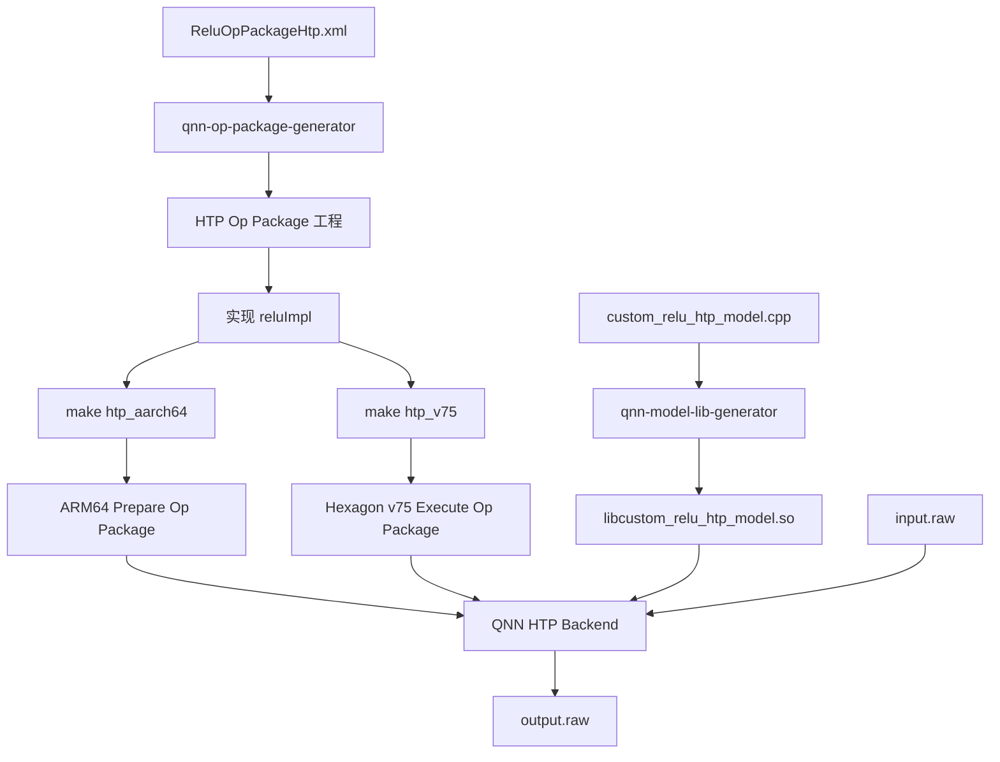
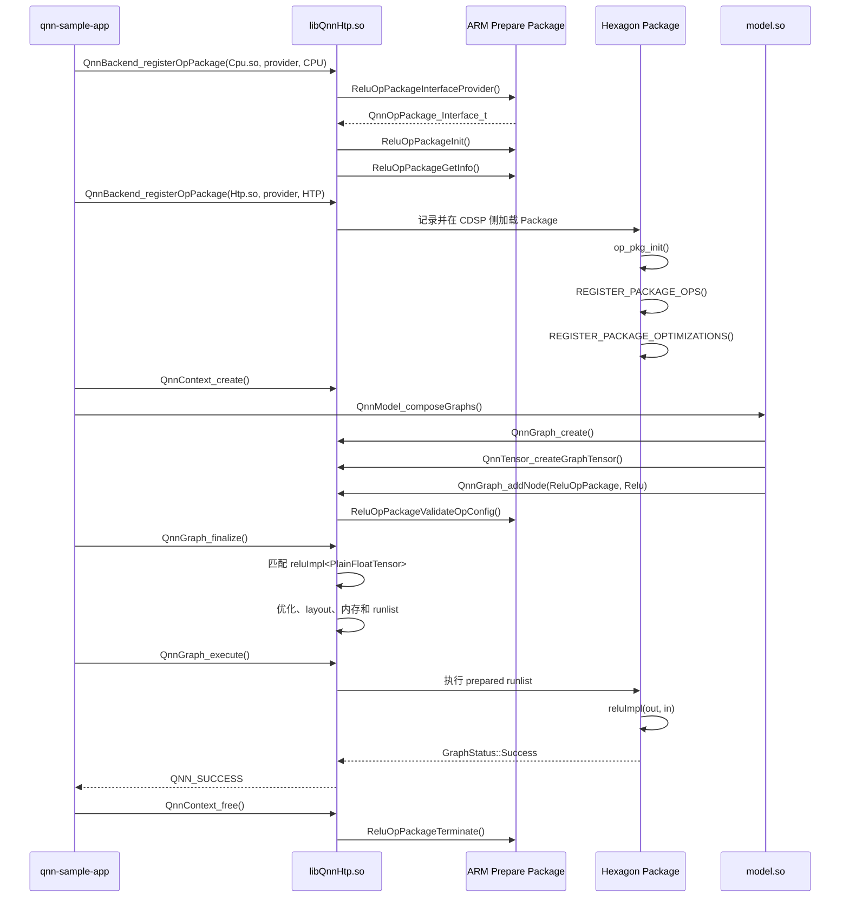

# QNN HTP Custom Relu Op Package 从生成到真机执行

本文记录在 QAIRT/QNN SDK 2.47 中实现一个 HTP 自定义 Relu 算子，并在 Snapdragon 8 Gen 3 手机的 HTP 上完成图准备、DSP 执行和结果校验的完整流程。

本文对应的 CPU 版本见同目录下的 `relu_custom_op_package_cpu.md`。HTP 与 CPU 最大的区别是：HTP 在线准备流程需要同时提供 ARM64 和 Hexagon 两个架构的 Op Package 动态库。

## 1. 实验环境

```text
QAIRT SDK       : /home/lingbok/Qualcomm/qairt/2.47.0.260601
QAIRT version   : 2.47.0.260601
Android NDK     : /home/lingbok/android/android-ndk-r28
Hexagon SDK     : /local/mnt/workspace/Qualcomm/Hexagon_SDK/5.5.5.0
Hexagon Tools   : 8.7.06
Hexagon target  : v75
Phone SoC       : SM8650 / Snapdragon 8 Gen 3
Backend         : libQnnHtp.so
Phone root dir  : /data/local/tmp/qnn
Lab root        : /home/lingbok/qnn_custom_op_lab
```

最终生成三个关键动态库：

```text
build/aarch64-android/libQnnReluOpPackage.so
  ARM64 Op Package，用于 HTP Prepare、算子注册和图准备

build/hexagon-v75/libQnnReluOpPackage.so
  Hexagon v75 Op Package，包含真正在 HTP/CDSP 上执行的 kernel

model_libs_htp/aarch64-android/libcustom_relu_htp_model.so
  测试模型，构造 input -> ReluOpPackage::Relu -> output Graph
```

## 2. 整体链路



运行时调用关系：

```text
qnn-sample-app
  -> dlopen(libQnnHtp.so)
  -> backendCreate()
  -> deviceCreate()
  -> register ARM64 Op Package，target=CPU
       -> 加载 libQnnHtpPrepare.so
       -> 加载 ARM64 libQnnReluOpPackage_Cpu.so
  -> register Hexagon Op Package，target=HTP
       -> 记录 DSP 库 libQnnReluOpPackage_Htp.so
  -> contextCreate()
       -> CDSP 通过 ADSP_LIBRARY_PATH 加载 Hexagon Op Package
  -> dlopen(libcustom_relu_htp_model.so)
  -> QnnModel_composeGraphs()
  -> graphCreate(customReluHtpGraph)
  -> tensorCreate(input)
  -> tensorCreate(output)
  -> graphAddNode(ReluOpPackage::Relu)
  -> graphFinalize()
       -> ARM Prepare 完成匹配、优化、内存规划和调度
  -> graphExecute()
       -> CDSP 调用 Hexagon Op Package 中的 reluImpl()
  -> 写出 output.raw
```

## 3. 为什么 HTP 需要两个 Op Package

两份库虽然来自同一套源代码，但编译架构和职责不同：

| 构建目标 | ELF 架构 | 运行位置 | 作用 |
| --- | --- | --- | --- |
| `htp_aarch64` | ARM64 | Android CPU | 在线 Prepare、注册和图构建 |
| `htp_v75` | QUALCOMM DSP6 | Hexagon/CDSP | 执行自定义 kernel |

不能把 ARM64 `.so` 交给 DSP，也不能让 Android 进程直接 `dlopen()` Hexagon `.so`。

真机运行时使用两个 target：

```text
libQnnReluOpPackage_Cpu.so:ReluOpPackageInterfaceProvider:CPU
libQnnReluOpPackage_Htp.so:ReluOpPackageInterfaceProvider:HTP
```

这里的 `CPU` 不表示 Graph 在 CPU backend 上执行。它表示这份 Op Package 是 HTP 在线准备流程中的 ARM/CPU 版本；最终 Graph 仍由 `libQnnHtp.so` 驱动并在 HTP 上执行。

## 4. 配置 QAIRT Python 环境

QAIRT 2.47 的 Python 扩展依赖 Python 3.12。Python 3.10 环境会出现：

```text
ImportError: libpython3.12.so.1.0: cannot open shared object file
```

创建环境：

```bash
conda create -n qairt-2.47 python=3.12
conda activate qairt-2.47
conda install numpy lxml mako
```

配置 QAIRT：

```bash
export QAIRT_SDK_ROOT=/home/lingbok/Qualcomm/qairt/2.47.0.260601
export QNN_SDK_ROOT="$QAIRT_SDK_ROOT"
export ANDROID_NDK_ROOT=/home/lingbok/android/android-ndk-r28

export PYTHONPATH="$QAIRT_SDK_ROOT/lib/python"
export LD_LIBRARY_PATH="$CONDA_PREFIX/lib:$QAIRT_SDK_ROOT/lib/x86_64-linux-clang:$LD_LIBRARY_PATH"
export PATH="$QAIRT_SDK_ROOT/bin/x86_64-linux-clang:$ANDROID_NDK_ROOT:$PATH"
unset PYTHONHOME
```

验证：

```bash
python3 --version
qnn-op-package-generator --help
qnn-model-lib-generator --help
```

## 5. 安装并选择 Hexagon SDK

### 5.1 QPM 中容易混淆的产品

QPM 中可以同时看到 Hexagon SDK 5.x、6.x 和 Hexagon Toolchain。它们不是 QAIRT SDK 版本：

```text
QAIRT 2.47       QNN/QAIRT 软件栈版本
Hexagon SDK 5.5.5 Hexagon 开发包版本
Hexagon Tools 8.7.06 Hexagon Clang 工具链版本
v75              目标 Hexagon 架构
```

本实验的生成 Makefile 对 v75 明确指定：

```make
HEXAGON_SDK_ROOT_V75 := .../hexagon-sdk-5.5.5
HEXAGON_TOOLS_VERSION_V75 := 8.7.06
```

因此最终使用：

```bash
export HEXAGON_SDK_ROOT=/local/mnt/workspace/Qualcomm/Hexagon_SDK/5.5.5.0
export HEXAGON_TOOLS_ROOT="$HEXAGON_SDK_ROOT/tools/HEXAGON_Tools/8.7.06"
```

验证：

```bash
"$HEXAGON_TOOLS_ROOT/Tools/bin/hexagon-clang++" --version
ls "$HEXAGON_SDK_ROOT/rtos/qurt/computev75/include/qurt"
```

应看到：

```text
QuIC LLVM Hexagon Clang version 8.7.06
```

### 5.2 为什么 8.7.03 能编译测试文件但仍换成 8.7.06

Tools 8.7.03 可以接受 `-mv75`，因此简单测试能够编译：

```bash
printf 'int test() { return 0; }\n' > /tmp/hexagon_v75_test.cpp

"$HEXAGON_TOOLS_ROOT/Tools/bin/hexagon-clang++" \
  -mv75 -fPIC -c /tmp/hexagon_v75_test.cpp \
  -o /tmp/hexagon_v75_test.o
```

但“编译器认识 `-mv75`”不等于它是 QAIRT 2.47 生成 Makefile 声明的受支持组合。本实验按 Makefile 使用 SDK 5.5.5 和 Tools 8.7.06，以减少 ABI、头文件和 libnative 不匹配风险。

### 5.3 SDK 6.5.0 是什么

生成 Makefile 中还会出现：

```make
HEXAGON_SDK_ROOT_V85 := .../hexagon-sdk-6.5.0
HEXAGON_TOOLS_VERSION_V85 := 21.0.03
HEXAGON_SDK_ROOT_X86 := $(HEXAGON_SDK_ROOT_V85)
```

SDK 6.5.0 是 v85 和默认 x86/libnative 路径使用的版本，不是本机 v75 kernel 的目标 SDK。本实验只安装了 5.5.5，因此在构建命令中显式覆盖 `HEXAGON_SDK_ROOT_X86` 和 `HEXAGON_TOOLS_VERSION_X86`，让 Makefile 的前置检查使用 5.5.5 中已有的 libnative。

## 6. 生成 HTP Op Package

工作目录：

```bash
mkdir -p ~/qnn_custom_op_lab
cd ~/qnn_custom_op_lab
```

生成：

```bash
qnn-op-package-generator \
  --config_path "$QAIRT_SDK_ROOT/examples/QNN/OpPackageGenerator/ReluOpPackageHtp.xml" \
  --output_path "$HOME/qnn_custom_op_lab/generated_htp" \
  --debug
```

输出目录：

```text
generated_htp/ReluOpPackage/
├── Makefile
├── config/ReluOpPackageHtp.xml
└── src
    ├── ReluOpPackageInterface.cpp
    └── ops/Relu.cpp
```

如果生成时出现：

```text
HTP/DSP/LPAI Operation detected but HEXAGON_SDK_ROOT is not set
```

它只是提示后续编译需要 Hexagon SDK；只要最后出现 `Code generation is complete`，骨架生成已经成功。设置环境变量后再编译即可。

## 7. XML 定义了什么

`ReluOpPackageHtp.xml` 中的核心信息：

```text
PackageName      = ReluOpPackage
Op Name          = Relu
SupportedBackend = HTP
Input count      = 1
Output count     = 1
```

Supplemental HTP 定义支持：

```text
QNN_DATATYPE_FLOAT_32
QNN_DATATYPE_UFIXED_POINT_8
QNN_DATATYPE_UFIXED_POINT_16
```

XML 描述的是算子接口和支持的数据类型；它不会自动生成 Relu 的计算逻辑。真正的计算逻辑需要填写到 `src/ops/Relu.cpp`。

## 8. 实现 HTP Relu Kernel

### 8.1 注册宏

包定义范围：

```cpp
BEGIN_PKG_OP_DEFINITION(PKG_Relu);
// registrations and implementations
END_PKG_OP_DEFINITION(PKG_Relu);
```

注册通用 Tensor 实现：

```cpp
DEF_PACKAGE_OP((reluImpl<Tensor>), "Relu")
```

为了让本次 FLOAT32 测试模型匹配 `PlainFloatTensor`，增加：

```cpp
DEF_PACKAGE_OP_AND_COST_AND_FLAGS(
    (reluImpl<PlainFloatTensor>), "Relu", SNAIL)
```

`SNAIL` 是调度成本等级，不是计算逻辑。当前实现的目标是先验证完整 HTP 链路，因此使用清晰的标量实现；后续性能优化应改成 HVX 向量化 kernel，并重新评估 cost 和资源 flags。

### 8.2 本次执行成功的实现

```cpp
#include <cmath>

template <typename TensorType>
GraphStatus reluImpl(TensorType& out_0, const TensorType& in_0) {
  out_0.set_dims(in_0);

  for (Idx b = 0; b < in_0.dim(0); ++b) {
    for (Idx h = 0; h < in_0.dim(1); ++h) {
      for (Idx w = 0; w < in_0.dim(2); ++w) {
        for (Idx d = 0; d < in_0.dim(3); ++d) {
          const float value = in_0(b, h, w, d);
          out_0(b, h, w, d) = fmaxf(value, 0.0f);
        }
      }
    }
  }

  return GraphStatus::Success;
}
```

代码含义：

- `out_0.set_dims(in_0)`：令输出逻辑形状与输入一致。
- `dim(0..3)`：按 BHWD 四维张量遍历。
- `in_0(b,h,w,d)`：通过 HTP Tensor abstraction 读取元素。
- `fmaxf(value, 0.0f)`：实现 `max(x, 0)`。
- `out_0(b,h,w,d)`：写入输出 Tensor。
- `GraphStatus::Success`：通知 HTP runtime kernel 执行成功。

当前代码假设 rank 为 4，这也是测试模型使用 `[1,1,1,4]` 的原因。若希望支持任意 rank，需要使用 HTP API 提供的通用遍历方式，或在 shape 规则中将输入规范化为 HTP kernel 所需布局。

### 8.3 写 HTP Op Package 时究竟要负责哪些文件

生成器创建的工程中，文件可以分成三层：

```text
config/ReluOpPackageHtp.xml
  算子的公开契约：Package、Op、输入、输出、参数、数据类型和 backend

src/ReluOpPackageInterface.cpp
  包级 ABI：初始化、查询信息、校验、日志、终止和 InterfaceProvider

src/ops/Relu.cpp
  HTP implementation 注册、tensor 类型匹配、cost/flags 和 kernel
```

对初学者而言，主要需要维护：

```text
1. XML
2. src/ops/<YourOp>.cpp
3. 用于测试的 model.cpp
```

`ReluOpPackageInterface.cpp` 通常由生成器维护，但不能完全不看。你至少要理解其中的：

- Package 名从哪里来。
- Op 名如何加入 Package info。
- 输入输出数量在哪里校验。
- `InterfaceProvider` 导出了哪些回调。
- 为什么 HTP 的 `createOpImpl` 和 `freeOpImpl` 可以是 `nullptr`。

如果 XML 改变了 Op 名、输入输出或参数，推荐重新运行生成器并对比生成结果，而不是长期手工维护 Interface 文件。

### 8.4 `ReluOpPackageInterfaceProvider()`：动态库的入口

SampleApp 注册 Op Package 时传入：

```text
libQnnReluOpPackage_*.so
ReluOpPackageInterfaceProvider
CPU 或 HTP target
```

Backend 加载 `.so` 后查找导出符号：

```cpp
extern "C"
Qnn_ErrorHandle_t ReluOpPackageInterfaceProvider(
    QnnOpPackage_Interface_t* interface) {
  if (!interface) {
    return QNN_OP_PACKAGE_ERROR_INVALID_ARGUMENT;
  }

  interface->interfaceVersion      = {1, 4, 0};
  interface->v1_4.init             = ReluOpPackageInit;
  interface->v1_4.terminate        = ReluOpPackageTerminate;
  interface->v1_4.getInfo          = ReluOpPackageGetInfo;
  interface->v1_4.validateOpConfig = ReluOpPackageValidateOpConfig;
  interface->v1_4.createOpImpl     = nullptr;
  interface->v1_4.freeOpImpl       = nullptr;
  interface->v1_4.logInitialize    = ReluOpPackageLogInitialize;
  interface->v1_4.logSetLevel      = ReluOpPackageLogSetLevel;
  interface->v1_4.logTerminate     = ReluOpPackageLogTerminate;
  return QNN_SUCCESS;
}
```

它本身不计算 Relu。它只把一张“函数表”交给 QNN backend：

```text
init              Package 初始化
getInfo           查询 Package 名、Op 列表和 API 版本
validateOpConfig  校验一个 node 是否属于本 Package、接口是否正确
terminate         Package 终止
log*              日志生命周期
```

之所以使用 `extern "C"`，是为了禁止 C++ name mangling，使 SampleApp 能用固定字符串通过 `dlsym()` 找到入口。

### 8.5 Package 级函数分别做什么

#### `ReluOpPackageInit()`

生成代码的核心行为：

```cpp
Qnn_ErrorHandle_t ReluOpPackageInit(
    QnnOpPackage_GlobalInfrastructure_t infrastructure) {
  if (sg_packageInitialized) {
    return QNN_OP_PACKAGE_ERROR_LIBRARY_ALREADY_INITIALIZED;
  }

  REGISTER_PACKAGE_PARAM_ORDERS()
  REGISTER_PACKAGE_AXIS_PARAMS()
  REGISTER_PACKAGE_PER_CHANNEL_QUANTIZED_OPS()

  sg_globalInfra = infrastructure;
  sg_packageInitialized = true;
  return QNN_SUCCESS;
}
```

它在 Package 被 backend 初始化时执行一次，负责注册 Package 范围的元信息。

对更复杂的算子，这里相关的三个概念很重要：

- Parameter order：决定参数传入 kernel 的顺序。
- Axis params：告诉 HTP 哪些参数表示 axis，以便 rank backfill 后修正 axis。
- Per-channel quantization：声明哪些 Op 支持按最后一维的 per-channel scale。

当前 Relu 没有参数，也没有 axis 和 per-channel 声明，所以这些注册表为空。

#### `ReluOpPackageGetInfo()`

它向 backend 返回：

```text
packageName     = ReluOpPackage
operationNames = [Relu]
numOperations  = 1
sdkBuildId
sdkApiVersion
```

Backend 依靠这些信息建立：

```text
(packageName, typeName) -> 已注册的 Op Package
```

因此模型中的：

```cpp
packageName = "ReluOpPackage";
typeName    = "Relu";
```

必须与 Package info 完全一致，大小写也必须一致。

#### `ReluOpPackageValidateOpConfig()`

本次生成代码执行两层校验：

```cpp
if (std::string(sg_packageName) != opConfig.v1.packageName) {
  return QNN_OP_PACKAGE_ERROR_VALIDATION_FAILURE;
}

if (std::string(opConfig.v1.typeName) == "Relu") {
  if (opConfig.v1.numOfParams != 0 ||
      opConfig.v1.numOfInputs != 1 ||
      opConfig.v1.numOfOutputs != 1) {
    return QNN_OP_PACKAGE_ERROR_VALIDATION_FAILURE;
  }
} else {
  return QNN_OP_PACKAGE_ERROR_VALIDATION_FAILURE;
}
```

它只证明 node 的“外形”正确：

```text
Package 名正确
Op 名正确
0 个参数
1 个输入
1 个输出
```

如果自己写新算子，通常还应补充：

- 每个输入和输出的数据类型是否合法。
- rank 是否在支持范围内。
- 必须相同的维度是否相同。
- scalar/tensor 参数的类型和范围是否合法。
- 量化 encoding 是否是 kernel 真正支持的形式。

接口校验通过不代表一定存在可执行 implementation。后续 Prepare 还必须根据 tensor 类型找到匹配的 `DEF_PACKAGE_OP...` 注册项。

#### `ReluOpPackageTerminate()`

```cpp
sg_globalInfra = nullptr;
sg_packageInitialized = false;
```

它在 Package 卸载时清理包级状态。自己的 Package 如果创建了包级资源，应在此处成对释放；不要把 graph execute 期间需要频繁申请的临时堆内存放进 kernel。

### 8.6 `op_pkg_init()`：HTP Core 侧的 implementation 注册入口

`ReluOpPackageInterface.cpp` 中的宏：

```cpp
INIT_PKG_CORE_INIT_FUNC()
```

会生成一个类似下面的入口：

```cpp
extern "C" int op_pkg_init(PackageOpIf& pkg_if) {
  pkg_if._name = THIS_PKG_NAME_STR;

  if (sg_init) {
    return GraphStatus::Success;
  }

  REGISTER_PACKAGE_OPS();
  REGISTER_PACKAGE_OPTIMIZATIONS();
  sg_init = true;
  return GraphStatus::Success;
}
```

它负责把 `Relu.cpp` 中通过宏声明的内容注册进 HTP Core：

```text
具体 kernel implementations
cost
resource flags
optimization rules
parameter order
tensor properties
```

因此 HTP 有两层入口：

```text
ReluOpPackageInterfaceProvider()
  QNN Op Package ABI 层，供 backend 查询和校验 Package

op_pkg_init()
  HTP Core 层，把具体 implementation 和优化规则注册给执行引擎
```

CPU Op Package 常见的 `createOpImpl()/execute()/free()` 模式，在当前 HTP generated package 中没有直接使用：

```cpp
interface->v1_4.createOpImpl = nullptr;
interface->v1_4.freeOpImpl   = nullptr;
```

HTP 通过 Core 注册表和 `DEF_PACKAGE_OP...` 直接建立 Op 到 kernel implementation 的映射。

### 8.7 `BEGIN/END_PKG_OP_DEFINITION` 做了什么

每个外部 HTP Op 源文件顶部和底部需要：

```cpp
BEGIN_PKG_OP_DEFINITION(PKG_Relu);

// registrations, costs, properties, optimizations and kernels

END_PKG_OP_DEFINITION(PKG_Relu);
```

宏在 SDK 中大致展开为：

```cpp
#define BEGIN_PKG_OP_DEFINITION(NAME) INITIALIZE_TABLES()
#define END_PKG_OP_DEFINITION(NAME)   FINALIZE_TABLES(NAME)
```

可以把它理解为：

```text
BEGIN  开始收集本源文件声明的 Op 注册项和优化规则
END    固化这些表，并以 PKG_Relu 标识供 Package Interface 汇总
```

`PKG_Relu` 是 C++ 注册单元的标识，不是模型中填写的 `packageName`。模型真正匹配的是编译参数产生的 `ReluOpPackage` 和字符串 `Relu`。

### 8.8 `DEF_PACKAGE_OP...`：告诉 HTP 哪个函数能处理哪种 Tensor

当前文件有两个注册项：

```cpp
DEF_PACKAGE_OP((reluImpl<Tensor>), "Relu")

DEF_PACKAGE_OP_AND_COST_AND_FLAGS(
    (reluImpl<PlainFloatTensor>), "Relu", SNAIL)
```

它们不是在此处调用 `reluImpl()`，而是在构建静态注册信息：

```text
Op 名              Relu
函数地址            reluImpl<...>
输入/输出 C++ 类型   Tensor 或 PlainFloatTensor
cost                默认值或 SNAIL
resource flags       默认 RESOURCE_HVX 或显式 flags
```

Prepare 阶段拿到 node 后，会结合：

```text
node 的 Package/Op 名
QNN tensor datatype
HTP 选择的内部 tensor layout
输入输出 argument signature
constraints
cost
```

从同名 `Relu` 的多个候选 implementation 中选择一个可用实现。

这也是为什么一个 Op 可以同时注册多种 kernel：

```cpp
reluImpl<PlainFloatTensor>
reluImpl<PlainFloat16Tensor>
reluImpl<QUint8CroutonTensor>
reluImpl<QUint16CroutonTensor>
```

每个实现可以服务不同 datatype、layout 或存储位置。XML 声明“接口允许什么”，而这些注册宏决定“你实际实现了什么”。二者必须一致。

当前实验实际验证的是：

```text
QNN_DATATYPE_FLOAT_32
  -> PlainFloatTensor implementation
  -> reluImpl<PlainFloatTensor>()
```

### 8.9 kernel 函数签名和参数顺序

当前 kernel：

```cpp
template <typename TensorType>
GraphStatus reluImpl(TensorType& out_0,
                     const TensorType& in_0);
```

HTP implementation 函数通常按照下面的逻辑排列参数：

```text
输出 Tensor 引用
输入 Tensor const 引用
Op 参数对应的 Tensor/scalar
可选的量化辅助 Tensor
```

当前 Relu 没有参数，所以只有：

```text
out_0  可写输出
in_0   只读输入
```

不要因为模型的 `addNode()` 先写 inputs、后写 outputs，就把 kernel 参数也写成输入在前。HTP 注册函数签名约定与 QNN `addNode()` 参数排列不是同一层概念。

如果算子有多个参数，应使用 XML 定义它们，并考虑：

```cpp
DEF_PACKAGE_PARAM_ORDER(
    "YourOp",
    "param0", true, nullptr,
    "param1", false, defaultValue)
```

参数顺序定义会决定参数以什么顺序传入 implementation。没有定义时，通常沿用 `QnnGraph_addNode()` 中参数的顺序；一旦定义，未列出的参数可能被丢弃。

### 8.10 `Tensor` 与 `PlainFloatTensor` 的区别

可以先用下面的心智模型理解：

```text
Tensor
  HTP 的通用 tensor abstraction，匹配范围更宽

PlainFloatTensor
  FLOAT32、flat/plain layout 的具体 tensor 类型
```

模板参数不仅决定 C++ 中元素访问的类型，也参与 Prepare 的 implementation 匹配。

常见 HTP 类型还包括：

```text
PlainFloat16Tensor
QuantUint8Tensor
QUint8CroutonTensor
QUint16CroutonTensor
带 _TCM 后缀的 TCM 版本
```

`Plain` 和 `Crouton` 表示不同内部 layout，`_TCM` 表示数据位于 TCM 相关存储中。要写高性能 HTP 算子，不能只考虑 QNN datatype，还要理解 HTP Prepare 最终为 node 选择的 layout 和 memory placement。

### 8.11 `out_0.set_dims(in_0)` 属于哪个阶段

这行代码在 `reluImpl()` 执行时运行：

```cpp
out_0.set_dims(in_0);
```

它让输出 tensor 的运行时逻辑尺寸与输入一致。它不是 model 中 `Qnn_Tensor_t.dimensions` 的替代品：

```text
model.cpp dimensions
  Graph 构建时对外声明的 tensor shape

set_dims()
  implementation 内根据实际输入设置输出 tensor shape
```

静态 shape 的简单 Relu 中二者应一致。动态 shape 或 shape-changing op 需要更完整的 shape 推导、最大尺寸约束和 runtime shape 更新策略。

### 8.12 `reluImpl()` 在什么时候真正执行

它不会在以下阶段执行：

```text
backendRegisterOpPackage
contextCreate
QnnModel_composeGraphs
graphAddNode
graphFinalize
```

前面的阶段只完成加载、校验、implementation 选择、优化、调度和内存规划。

真正调用发生在：

```text
qnn-sample-app
  -> QnnGraph_execute()
  -> HTP runtime 执行 prepared runlist
  -> 调度 Relu node
  -> reluImpl<PlainFloatTensor>(out_0, in_0)
  -> GraphStatus::Success
```

本次日志中的：

```text
QnnGraph_finalize done. status 0x0
QnnGraph_execute started
Graph customReluHtpGraph execution finished with result 0
```

分别证明 Prepare 成功和执行成功。最终 `match : True` 才证明 kernel 的数值逻辑也正确。

### 8.13 从注册到执行的完整函数时序



具体 SDK 内部可能合并或延后某些初始化动作，但写 Op Package 时应掌握的逻辑层次就是：

```text
ABI 函数表 -> Package 信息/校验 -> HTP Core implementation 注册
-> Prepare 匹配与编译 -> graphExecute 调 kernel
```

### 8.14 自己写一个新 HTP Op 的标准步骤

假设以后写 `MyScale`，不要从 `reluImpl()` 直接开写。建议按下面顺序：

#### 第一步：先写算子契约

明确：

```text
PackageName
Op Name
输入数量、名称、datatype、rank
输出数量、名称、datatype、rank
参数名称、类型、是否 mandatory、默认值
输出 shape 如何由输入和参数决定
支持 FLOAT32、FP16 还是量化类型
```

把这些写进 XML，再运行 generator。

#### 第二步：检查生成的 Interface

重点检查：

```text
sg_packageName
sg_opNames
ValidateOpConfig 中 inputs/outputs/params 数量
InterfaceProvider 导出名
```

#### 第三步：定义 kernel signature

例如一个单输入、单输出、一个 scalar scale 的概念签名：

```cpp
template <typename TensorType, typename ScaleType>
GraphStatus myScaleImpl(TensorType& out,
                        const TensorType& in,
                        const ScaleType& scale);
```

实际参数是 Tensor 还是 scalar wrapper，应以 HTP API 和 generator 生成的参数形式为准。

#### 第四步：为每种真实支持的类型注册 implementation

```cpp
DEF_PACKAGE_OP_AND_COST_AND_FLAGS(
    (myScaleImpl<PlainFloatTensor, PlainFloatTensor>),
    "MyScale",
    SNAIL,
    Flags::RESOURCE_HVX)
```

不要只在 XML 中声明 datatype，却没有对应 C++ implementation。

#### 第五步：实现正确性版本

先写：

- 清晰、可验证的标量循环。
- 正确的 shape 设置。
- 输入参数检查。
- 明确的错误返回。
- 小尺寸输入输出测试。

执行函数中避免：

```text
malloc/free
new/delete
默认 allocator 的 std::vector 扩容
每次 execute 构造大容器
不可控的锁和系统调用
```

#### 第六步：建立最小测试 Graph

Graph 只保留：

```text
一个输入 -> 一个自定义 node -> 一个输出
```

用 NumPy 计算 reference，先证明：

```text
加载成功
Validate 成功
Finalize 成功
Execute 成功
数值匹配
```

#### 第七步：再扩展类型和性能

按顺序增加：

```text
更多 shape
更多 datatype
量化支持
Crouton/TCM implementation
HVX 向量化
cost function
optimization rules
profiling
```

一次只增加一个维度，否则很难判断失败发生在 ABI、Prepare、layout、kernel 还是数值层。

### 8.15 一个可复用的 HTP Op 源码骨架

```cpp
#include "HTP/core/constraints.h"
#include "HTP/core/op_package_feature_support.h"
#include "HTP/core/op_register_ext.h"
#include "HTP/core/optimize.h"
#include "HTP/core/simple_reg.h"
#include "QnnOpPackage.h"

BEGIN_PKG_OP_DEFINITION(PKG_MyOp);

template <typename TensorType>
GraphStatus myOpImpl(TensorType& out,
                     const TensorType& in);

DEF_PACKAGE_OP_AND_COST_AND_FLAGS(
    (myOpImpl<PlainFloatTensor>),
    "MyOp",
    SNAIL,
    Flags::RESOURCE_HVX)

template <typename TensorType>
GraphStatus myOpImpl(TensorType& out,
                     const TensorType& in) {
  out.set_dims(in);

  for (Idx b = 0; b < in.dim(0); ++b) {
    for (Idx h = 0; h < in.dim(1); ++h) {
      for (Idx w = 0; w < in.dim(2); ++w) {
        for (Idx d = 0; d < in.dim(3); ++d) {
          // Replace with the real operator formula.
          out(b, h, w, d) = in(b, h, w, d);
        }
      }
    }
  }

  return GraphStatus::Success;
}

END_PKG_OP_DEFINITION(PKG_MyOp);
```

这个骨架只适合开始学习，不等于高性能实现。写新 Op 时必须同步修改 XML、Package 名、Op 名、参数和 validation，不能只替换函数体。

### 8.16 阅读当前工程时的推荐顺序

为了真正掌握而不是只看到大量宏，建议按下面顺序逐行阅读：

```text
1. config/ReluOpPackageHtp.xml
   先回答：这个 Op 对外承诺什么？

2. model/custom_relu_htp_model.cpp
   再回答：Graph 如何引用 Package 和 Op？tensor 是什么 shape/type？

3. src/ReluOpPackageInterface.cpp
   再回答：动态库如何暴露 ABI？如何校验 node？

4. src/ops/Relu.cpp 中的 DEF_PACKAGE_OP...
   再回答：哪些 tensor 类型会匹配哪个 implementation？

5. reluImpl()
   最后回答：每个输出元素究竟怎样计算？

6. Makefile
   理解同一源代码如何生成 ARM64 Prepare 库和 Hexagon Execute 库。

7. qnn-sample-app 日志
   把每条日志对应回上述函数和阶段。
```

这样阅读时，宏不再是一片黑盒，而是分别落在“接口、注册、Prepare、执行”四个明确阶段。

## 9. 编译 Hexagon v75 执行库

先设置：

```bash
export SDK555=/local/mnt/workspace/Qualcomm/Hexagon_SDK/5.5.5.0
export HEXAGON_SDK_ROOT="$SDK555"
export HEXAGON_TOOLS_ROOT="$SDK555/tools/HEXAGON_Tools/8.7.06"

cd ~/qnn_custom_op_lab/generated_htp/ReluOpPackage
```

建议先用 `make -n` 查看将要执行的命令：

```bash
make -n htp_v75 \
  QNN_INCLUDE="$QNN_SDK_ROOT/include/QNN" \
  HEXAGON_SDK_ROOT="$SDK555" \
  HEXAGON_SDK_ROOT_V75="$SDK555" \
  HEXAGON_SDK_ROOT_X86="$SDK555" \
  HEXAGON_TOOLS_VERSION_V75=8.7.06 \
  HEXAGON_TOOLS_VERSION_X86=8.7.06
```

正式编译：

```bash
make htp_v75 \
  QNN_INCLUDE="$QNN_SDK_ROOT/include/QNN" \
  HEXAGON_SDK_ROOT="$SDK555" \
  HEXAGON_SDK_ROOT_V75="$SDK555" \
  HEXAGON_SDK_ROOT_X86="$SDK555" \
  HEXAGON_TOOLS_VERSION_V75=8.7.06 \
  HEXAGON_TOOLS_VERSION_X86=8.7.06
```

检查产物：

```bash
file build/hexagon-v75/libQnnReluOpPackage.so
readelf -Ws build/hexagon-v75/libQnnReluOpPackage.so \
  | grep ReluOpPackageInterfaceProvider
```

正确结果应包含：

```text
ELF 32-bit LSB shared object, QUALCOMM DSP6
ReluOpPackageInterfaceProvider
```

## 10. 编译 ARM64 Prepare 库

先查看命令：

```bash
make -n htp_aarch64 \
  QNN_INCLUDE="$QNN_SDK_ROOT/include/QNN" \
  QNN_TARGET_LIB="$QNN_SDK_ROOT/lib/aarch64-android" \
  ANDROID_NDK_ROOT="$ANDROID_NDK_ROOT" \
  HEXAGON_SDK_ROOT="$SDK555" \
  HEXAGON_SDK_ROOT_X86="$SDK555" \
  HEXAGON_TOOLS_VERSION_X86=8.7.06
```

正式编译：

```bash
make htp_aarch64 \
  QNN_INCLUDE="$QNN_SDK_ROOT/include/QNN" \
  QNN_TARGET_LIB="$QNN_SDK_ROOT/lib/aarch64-android" \
  ANDROID_NDK_ROOT="$ANDROID_NDK_ROOT" \
  HEXAGON_SDK_ROOT="$SDK555" \
  HEXAGON_SDK_ROOT_X86="$SDK555" \
  HEXAGON_TOOLS_VERSION_X86=8.7.06
```

检查：

```bash
file build/aarch64-android/libQnnReluOpPackage.so

readelf -Ws build/aarch64-android/libQnnReluOpPackage.so \
  | grep ReluOpPackageInterfaceProvider

readelf -d build/aarch64-android/libQnnReluOpPackage.so \
  | grep NEEDED
```

应看到：

```text
ELF 64-bit LSB shared object, ARM aarch64
libQnnHtp.so
libQnnHtpPrepare.so
```

## 11. 构造 HTP 测试模型

CPU 测试模型原来使用二维 `[1,4]`。本次 HTP `reluImpl()` 按 BHWD 四维接口访问，因此复制一份模型并改成 `[1,1,1,4]`：

```bash
cd ~/qnn_custom_op_lab
cp model/custom_relu_model.cpp model/custom_relu_htp_model.cpp
```

关键修改：

```cpp
"customReluGraph" -> "customReluHtpGraph"

uint32_t inputDimensions[] = {1, 1, 1, 4};
.rank = 4;

uint32_t outputDimensions[] = {1, 1, 1, 4};
.rank = 4;
```

自定义 node 必须保持：

```cpp
customReluModel.addNode(
    QNN_OPCONFIG_VERSION_1,
    "CustomRelu_0",
    "ReluOpPackage",
    "Relu",
    nullptr,
    0,
    inputNames,
    1,
    outputs,
    1);
```

模型库必须导出：

```cpp
QnnModel_composeGraphs(...)
QnnModel_freeGraphsInfo(...)
```

其中：

```text
packageName = ReluOpPackage
typeName    = Relu
```

这两个字符串把 model node 与自定义 Op Package 连接起来。

## 12. 编译 HTP 测试 Model Library

```bash
export PATH="$ANDROID_NDK_ROOT:$PATH"

qnn-model-lib-generator \
  -c "$HOME/qnn_custom_op_lab/model/custom_relu_htp_model.cpp" \
  -t aarch64-android \
  -l custom_relu_htp_model \
  -o "$HOME/qnn_custom_op_lab/model_libs_htp"
```

产物：

```text
~/qnn_custom_op_lab/model_libs_htp/aarch64-android/libcustom_relu_htp_model.so
```

模型库始终是 ARM64，因为 `qnn-sample-app` 在 Android ARM 进程中加载并调用 `QnnModel_composeGraphs()`。模型库不是 DSP kernel。

## 13. 准备输入数据

```bash
mkdir -p ~/qnn_custom_op_lab/input_htp

python3 - <<'PY'
import numpy as np

x = np.array([-2.0, -0.5, 1.5, 3.0], dtype=np.float32)
x.tofile("/home/lingbok/qnn_custom_op_lab/input_htp/input.raw")
print("input:", x)
PY
```

预期输出：

```text
[0.0, 0.0, 1.5, 3.0]
```

## 14. 部署到手机

### 14.1 创建目录

```bash
adb shell '
rm -rf /data/local/tmp/qnn/custom_relu_htp
mkdir -p /data/local/tmp/qnn/custom_relu_htp/lib
mkdir -p /data/local/tmp/qnn/custom_relu_htp/dsp
mkdir -p /data/local/tmp/qnn/custom_relu_htp/input
mkdir -p /data/local/tmp/qnn/custom_relu_htp/output
'
```

### 14.2 推送并直接使用不同文件名

模型：

```bash
adb push \
  ~/qnn_custom_op_lab/model_libs_htp/aarch64-android/libcustom_relu_htp_model.so \
  /data/local/tmp/qnn/custom_relu_htp/lib/
```

ARM64 Prepare 库：

```bash
adb push \
  ~/qnn_custom_op_lab/generated_htp/ReluOpPackage/build/aarch64-android/libQnnReluOpPackage.so \
  /data/local/tmp/qnn/custom_relu_htp/lib/libQnnReluOpPackage_Cpu.so
```

Hexagon v75 执行库：

```bash
adb push \
  ~/qnn_custom_op_lab/generated_htp/ReluOpPackage/build/hexagon-v75/libQnnReluOpPackage.so \
  /data/local/tmp/qnn/custom_relu_htp/dsp/libQnnReluOpPackage_Htp.so
```

输入：

```bash
adb push \
  ~/qnn_custom_op_lab/input_htp/input.raw \
  /data/local/tmp/qnn/custom_relu_htp/input/

adb shell 'printf "%s\n" \
"input:=/data/local/tmp/qnn/custom_relu_htp/input/input.raw" \
> /data/local/tmp/qnn/custom_relu_htp/input/input_list.txt'
```

检查：

```bash
adb shell '
file /data/local/tmp/qnn/custom_relu_htp/lib/libQnnReluOpPackage_Cpu.so
file /data/local/tmp/qnn/custom_relu_htp/dsp/libQnnReluOpPackage_Htp.so
find /data/local/tmp/qnn/custom_relu_htp -type f
'
```

## 15. 在手机 HTP 上运行

```bash
adb shell '
cd /data/local/tmp/qnn

export LD_LIBRARY_PATH="$PWD/custom_relu_htp/lib:$PWD/lib:$LD_LIBRARY_PATH"

export ADSP_LIBRARY_PATH="$PWD/custom_relu_htp/dsp;$PWD/dsp;$PWD/lib;/vendor/dsp/cdsp;/vendor/lib/rfsa/adsp;/system/lib/rfsa/adsp;/dsp"

rm -rf custom_relu_htp/output

./bin/qnn-sample-app \
  --backend lib/libQnnHtp.so \
  --model custom_relu_htp/lib/libcustom_relu_htp_model.so \
  --op_packages custom_relu_htp/lib/libQnnReluOpPackage_Cpu.so:ReluOpPackageInterfaceProvider:CPU,libQnnReluOpPackage_Htp.so:ReluOpPackageInterfaceProvider:HTP \
  --input_list custom_relu_htp/input/input_list.txt \
  --output_dir custom_relu_htp/output \
  --input_data_type float \
  --output_data_type float_only \
  --log_level info
'
```

注意 HTP 条目使用裸文件名：

```text
libQnnReluOpPackage_Htp.so
```

CDSP 通过 `ADSP_LIBRARY_PATH` 搜索它。不要写成 Android shell 当前目录下的相对路径。

## 16. 成功日志如何判断

两份库注册成功：

```text
Loaded package ReluOpPackage from file ...libQnnReluOpPackage_Cpu.so
Registered Op Package: ...libQnnReluOpPackage_Cpu.so
Registered Op Package: libQnnReluOpPackage_Htp.so
```

Context 和 Graph 成功：

```text
QnnContext_create done successfully
QnnGraph_create done. status 0x0
QnnBackend_validateOpConfig done successfully
QnnGraph_addNode done. status 0x0
QnnGraph_finalize done. status 0x0
```

HTP 执行成功：

```text
QnnGraph_execute started
Graph customReluHtpGraph execution finished with result 0
QnnGraph_execute done. status 0x0
```

这些日志共同证明：模型节点被自定义 Package 接受、Graph 完成 HTP Prepare，并成功在 HTP 执行。

## 17. 验证输出

```bash
rm -rf ~/qnn_custom_op_lab/output_htp

adb pull \
  /data/local/tmp/qnn/custom_relu_htp/output \
  ~/qnn_custom_op_lab/output_htp
```

```bash
python3 - <<'PY'
import numpy as np
from pathlib import Path

root = Path.home() / "qnn_custom_op_lab"

input_data = np.fromfile(root / "input_htp/input.raw", dtype=np.float32)
output_file = next((root / "output_htp").rglob("*.raw"))
output_data = np.fromfile(output_file, dtype=np.float32)

print("input :", input_data)
print("output:", output_data)
print("expect:", np.maximum(input_data, 0))
print("match :", np.allclose(output_data, np.maximum(input_data, 0)))
PY
```

本次实际结果：

```text
input : [-2.  -0.5  1.5  3. ]
output: [0.  0.  1.5 3. ]
expect: [0.  0.  1.5 3. ]
match : True
```

## 18. 本次问题与原因总结

### 18.1 `qnn-op-package-generator：未找到命令`

原因：QAIRT 的 host bin 目录没有加入 `PATH`，或者切换 Conda 环境后环境变量丢失。

解决：

```bash
export PATH="$QAIRT_SDK_ROOT/bin/x86_64-linux-clang:$PATH"
```

### 18.2 `No module named 'qti'`

原因：没有把 QAIRT Python 包加入 `PYTHONPATH`。

解决：

```bash
export PYTHONPATH="$QAIRT_SDK_ROOT/lib/python"
```

### 18.3 缺少 `libpython3.12.so.1.0`

原因：使用了 Python 3.10，而 QAIRT 2.47 的预编译 Python extension 依赖 Python 3.12。

解决：使用 `qairt-2.47` Python 3.12 Conda 环境，并将 `$CONDA_PREFIX/lib` 放入 `LD_LIBRARY_PATH`。

### 18.4 缺少 `numpy`、`lxml`、`mako`

原因：生成器的 Python 运行依赖没有安装完整。

解决：

```bash
conda install numpy lxml mako
```

### 18.5 `HEXAGON_SDK_ROOT` 和 `HEXAGON_TOOLS_ROOT` 为空

原因：QAIRT 不自带完整 Hexagon 编译工具链，必须另外安装 Hexagon SDK，并在当前 shell 中导出环境变量。

解决：安装 SDK 5.5.5 后配置：

```bash
export HEXAGON_SDK_ROOT=/local/mnt/workspace/Qualcomm/Hexagon_SDK/5.5.5.0
export HEXAGON_TOOLS_ROOT="$HEXAGON_SDK_ROOT/tools/HEXAGON_Tools/8.7.06"
```

### 18.6 QPM 安装 5.4 时下载旧 JRE 返回 403

错误示例：

```text
Failed to connect to .../jre-8u51-linux-x64.tar.gz
Server responded with 403
```

这是旧版 SDK 安装组件引用的外部 JRE 地址失效，不是 QNN 源码问题。最终安装符合 v75 Makefile 要求的 Hexagon SDK 5.5.5，并使用其中的 Tools 8.7.06，绕开旧 JRE 依赖链。

### 18.7 为什么编译命令覆盖 X86 变量

生成 Makefile 即使构建 `htp_v75`，也会在解析阶段检查：

```text
HEXAGON_SDK_ROOT_X86
HEXAGON_TOOLS_VERSION_X86
```

默认值指向 SDK 6.5.0/Tools 21.0.03。本机只有 SDK 5.5.5，因此显式覆盖为 5.5.5/8.7.06，使 Makefile 能找到 libnative。它不会把 v75 kernel 编译成 x86；真正的 DSP 编译器仍由 `HEXAGON_SDK_ROOT_V75` 和 `HEXAGON_TOOLS_VERSION_V75` 决定。

### 18.8 只注册一个没有 target 的 Op Package，Context 创建失败

错误流程：

```bash
--op_packages custom_relu_htp/lib/libQnnReluOpPackage.so:ReluOpPackageInterfaceProvider
```

日志：

```text
Failed to register op package ... err = 4005
Failed to register op packages with err 4007
Could not create context
```

原因：没有指定 `CPU`/`HTP` target，backend 将同一个 ARM64 package 路径继续用于 Skel/DSP 侧注册。

正确方式是同时注册两份库：

```text
arm64.so:provider:CPU,dsp.so:provider:HTP
```

### 18.9 已指定两个 target，仍然报 `4005/4007`

失败写法：

```text
custom_relu_htp/dsp/libQnnReluOpPackage.so:ReluOpPackageInterfaceProvider:HTP
```

错误码：

```text
4005 = QNN_BACKEND_ERROR_OP_PACKAGE_NOT_FOUND
4007 = QNN_BACKEND_ERROR_OP_PACKAGE_REGISTRATION_FAILED
```

原因：Android 进程能够理解 `custom_relu_htp/dsp/...`，但 CDSP/FastRPC 不能按 Android 当前工作目录解析这个相对路径。DSP 动态加载器通过 `ADSP_LIBRARY_PATH` 搜索库。

解决：

1. 将 DSP 库命名为 `libQnnReluOpPackage_Htp.so`。
2. 将其目录加入 `ADSP_LIBRARY_PATH`。
3. `--op_packages` 的 HTP 项只传裸文件名。

```text
libQnnReluOpPackage_Htp.so:ReluOpPackageInterfaceProvider:HTP
```

### 18.10 为什么必须重命名 `_Cpu.so` 和 `_Htp.so`

两份构建产物默认都叫：

```text
libQnnReluOpPackage.so
```

但它们的 ELF 架构不同。重命名后可以避免推送时覆盖，也能清楚表达 target：

```text
libQnnReluOpPackage_Cpu.so  ARM64
libQnnReluOpPackage_Htp.so  Hexagon DSP6
```

### 18.11 手机 `file` 显示 `bad note 22 size?`

示例：

```text
ELF shared object, 32-bit LSB hexagon, bad note 22 size?
```

手机自带 `file` 对 Hexagon ELF note 的解析不完整。这不表示 `.so` 损坏。Host 上的 `file`、`readelf` 检查正常，并且 DSP 已成功加载和执行，所以该提示可以忽略。

### 18.12 `LIBNATIVE: No alternate configuration present`

这是 libnative 使用默认 thread-local 行为的提示，不是运行失败。后续 Context、Finalize 和 Execute 均成功时无需处理。

### 18.13 `Setting libnative architecture to v79 (requested arch is v75)`

本机 SoC 被 HTP runtime 识别为 SM8650，runtime 内部选择了对应的 libnative architecture 配置。自定义 package 仍以 v75 构建并成功加载，Graph 也完成执行，因此这条 INFO 不是当前实验的错误。

### 18.14 Graph 为什么使用 `[1,1,1,4]` 而不是 `[1,4]`

本次 `reluImpl()` 明确访问 `dim(0)` 到 `dim(3)`，并使用 `(b,h,w,d)` 四维索引。二维 tensor 无法满足这个 kernel 的访问约定，所以测试模型改为 BHWD `[1,1,1,4]`。元素数量仍然是 4，输入 raw 文件不需要改变。

## 19. 当前实现的边界

本实验已经验证 HTP 自定义算子的完整工程链路，但它仍是学习用 reference kernel：

- 只实际验证了 `QNN_DATATYPE_FLOAT_32`。
- XML 虽声明 UFIXED8/UFIXED16，当前 `fmaxf` 实现没有完成量化类型适配。
- 当前按四维 BHWD 遍历，不是任意 rank 通用实现。
- 当前是标量循环，没有使用 HVX intrinsic 或 HTP tensor/vector helper 做性能优化。
- `reluCostFunc()` 尚未用于真实 cost 评估。
- 尚未加入 shape validation、量化参数校验和更完整的错误返回。

下一阶段可以依次学习：

1. 为不同数据类型注册不同的 HTP implementation。
2. 增加约束和 shape/type validation。
3. 实现 HVX 向量化 Relu，并对比标量版本性能。
4. 学习 `DEF_PACKAGE_OPTIMIZATION`，为 Graph Prepare 添加优化规则。
5. 使用 profiling 验证自定义 node 的执行时间和调度资源。
6. 构建包含多个自定义 node、参数和中间 tensor 的测试 Graph。

## 20. 最终结论

本实验成功完成：

```text
ReluOpPackageHtp.xml
  -> 生成 HTP 工程
  -> 实现 reluImpl()
  -> 编译 ARM64 Prepare package
  -> 编译 Hexagon v75 execute package
  -> 构建 customReluHtpGraph model library
  -> 分别注册 CPU/HTP target
  -> ARM 在线 Prepare
  -> CDSP 加载自定义 kernel
  -> HTP graphExecute
  -> output.raw 与 NumPy Relu 结果一致
```

最终验证：

```text
input : [-2.  -0.5  1.5  3. ]
output: [0.  0.  1.5 3. ]
match : True
```

这说明自定义 Relu 不仅完成了编译和注册，而且已经真正进入 QNN HTP Graph，并在手机 HTP 执行链路中得到正确结果。
