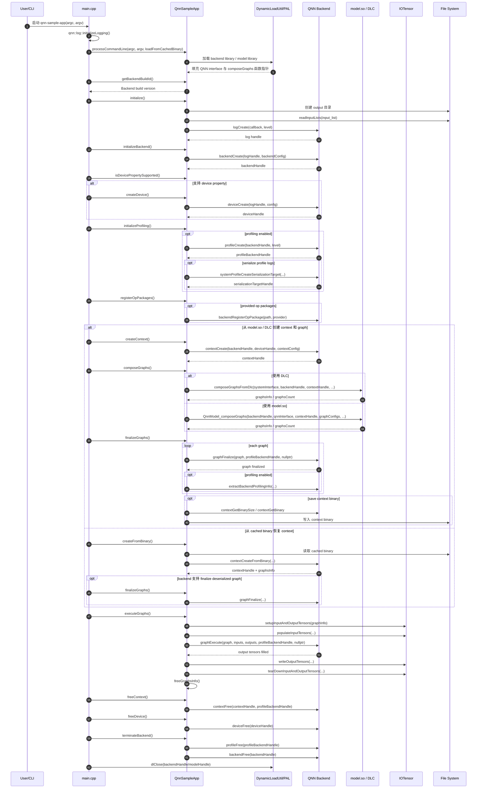
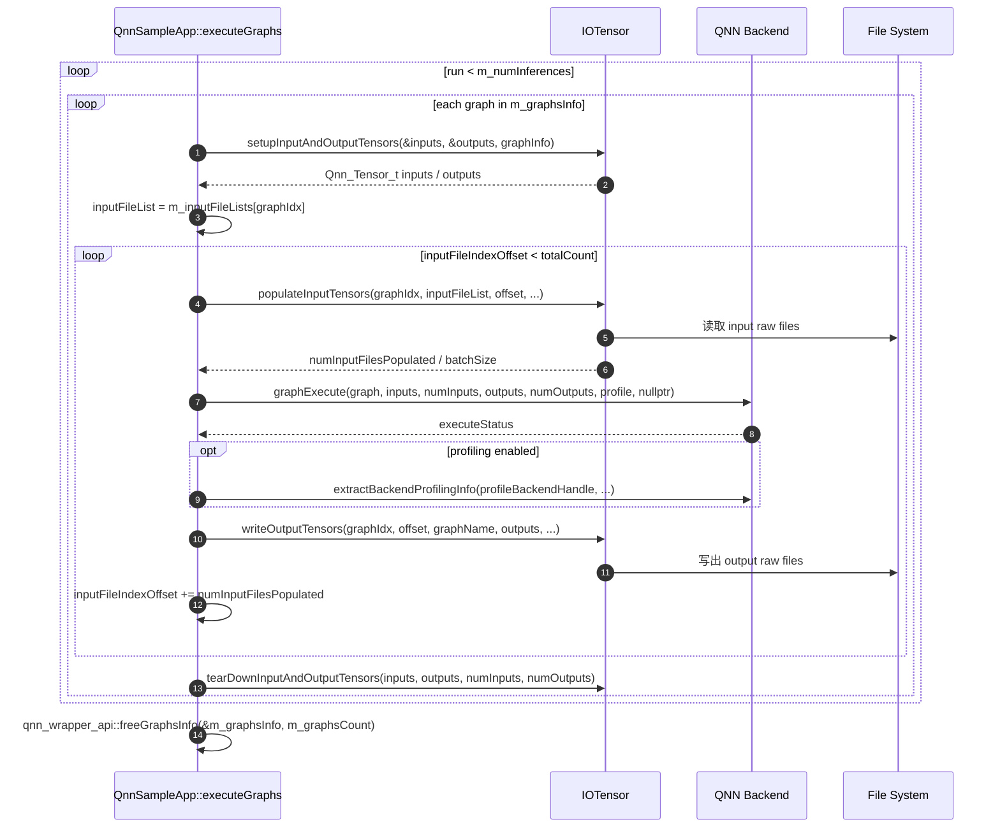

# QNN SampleApp 调用时序图

本文档根据 `examples/QNN/SampleApp/SampleApp/src/main.cpp` 和
`examples/QNN/SampleApp/SampleApp/src/QnnSampleApp.cpp` 梳理
`qnn-sample-app` 的主要执行链路。

## 主流程



## executeGraphs 内部流程



## 关键函数对应关系

| 阶段 | SampleApp 函数 | 主要 QNN / 工具调用 |
| --- | --- | --- |
| 参数解析与动态库加载 | `processCommandLine` | 加载 backend/model library，解析命令行参数 |
| 基础初始化 | `QnnSampleApp::initialize` | `readInputLists`、`logCreate` |
| Backend 初始化 | `QnnSampleApp::initializeBackend` | `backendCreate` |
| Device 创建 | `QnnSampleApp::createDevice` | `deviceCreate` |
| Profiling 初始化 | `QnnSampleApp::initializeProfiling` | `profileCreate`、`systemProfileCreateSerializationTarget` |
| Context 创建 | `QnnSampleApp::createContext` | `contextCreate` |
| Graph 组成 | `QnnSampleApp::composeGraphs` | `QnnModel_composeGraphs` 或 `composeGraphsFromDlc` |
| Graph finalize | `QnnSampleApp::finalizeGraphs` | `graphFinalize`，可选 `saveBinary` |
| Cached binary 恢复 | `QnnSampleApp::createFromBinary` | 从 context binary 创建 context 和 graph |
| Graph 执行 | `QnnSampleApp::executeGraphs` | `setupInputAndOutputTensors`、`populateInputTensors`、`graphExecute`、`writeOutputTensors` |
| 资源释放 | `freeContext`、`freeDevice`、`terminateBackend` | `contextFree`、`deviceFree`、`profileFree`、`backendFree` |

## 阅读提示

- `main.cpp` 控制整体顺序，并在每一步失败时通过 `reportError` 记录错误。
- `QnnSampleApp.cpp` 把 QNN C API 包装成 SampleApp 的成员函数。
- 非 cached binary 路径是 `createContext -> composeGraphs -> finalizeGraphs -> executeGraphs`。
- cached binary 路径是 `createFromBinary -> 可选 finalizeGraphs -> executeGraphs`。
- `executeGraphs` 会在函数末尾调用 `freeGraphsInfo`，而 `freeContext` 负责释放 context 以及残留的 graph/tensor 元数据。

## 编译与运行

本节记录如何在当前机器上编译并运行 SDK 自带的 `SampleApp`，以及如何观察实际的 context、graph、input、output 信息。

当前路径：

```text
QAIRT SDK: /home/lingbok/Qualcomm/qairt/2.47.0.260601
SampleApp: /home/lingbok/Qualcomm/qairt/2.47.0.260601/examples/QNN/SampleApp/SampleApp
Phone dir: /data/local/tmp/qnn
```

主机端设置：

```bash
export QAIRT_SDK_ROOT=/home/lingbok/Qualcomm/qairt/2.47.0.260601
export ANDROID_NDK_ROOT=/home/lingbok/android/android-ndk-r28
export QNN_PHONE_DIR=/data/local/tmp/qnn
```

确认手机连接和手机端 QNN 目录：

```bash
adb devices

adb shell "ls $QNN_PHONE_DIR/bin"
adb shell "ls $QNN_PHONE_DIR/lib"
adb shell "ls $QNN_PHONE_DIR/dsp"
adb shell "ls $QNN_PHONE_DIR/mobilenet_v2"
```

当前示例使用已经部署到手机端的 MobileNet V2 context：

```text
/data/local/tmp/qnn/mobilenet_v2/
  mobilenet_v2.bin
  input/
    input_list.txt
    image_tensor.raw
```

其中：

| 文件 | 含义 |
| --- | --- |
| `mobilenet_v2.bin` | 已编译好的 QNN context binary |
| `input/input_list.txt` | input tensor 名字和 raw 文件路径的映射 |
| `input/image_tensor.raw` | 真正喂给模型的二进制输入 tensor 数据 |

## 编译 SampleApp

进入 SampleApp 目录：

```bash
cd $QAIRT_SDK_ROOT/examples/QNN/SampleApp/SampleApp
```

编译 Android arm64 可执行文件：

```bash
make aarch64-android
```

正常情况下产物会生成到：

```text
bin/aarch64-android/qnn-sample-app
```

如果编译最后出现类似错误：

```text
find: PATH 环境变量中含有相对路径 '~/anaconda3/bin'，这对于 find 的 -execdir 动作而言是不安全的
make: *** [Makefile:46：aarch64-android] 错误 1
```

说明 C++ 编译和链接已经成功，只是最后移动目录失败。可以手动收尾：

```bash
cd $QAIRT_SDK_ROOT/examples/QNN/SampleApp/SampleApp

mkdir -p bin
mv libs/arm64-v8a bin/aarch64-android
rm -rf libs
```

检查产物：

```bash
ls -lh bin/aarch64-android/qnn-sample-app
file bin/aarch64-android/qnn-sample-app
```

推送到手机：

```bash
adb push bin/aarch64-android/qnn-sample-app /data/local/tmp/qnn/bin/
adb shell "chmod +x /data/local/tmp/qnn/bin/qnn-sample-app"
```

## 执行 SampleApp

本例使用 HTP backend，并从已有 context binary 恢复 graph：

```bash
adb shell '
cd /data/local/tmp/qnn

export LD_LIBRARY_PATH="$PWD/lib:$LD_LIBRARY_PATH"
export ADSP_LIBRARY_PATH="$PWD/dsp;$PWD/lib;/vendor/dsp/cdsp;/vendor/lib/rfsa/adsp;/system/lib/rfsa/adsp;/dsp"

./bin/qnn-sample-app \
  --backend lib/libQnnHtp.so \
  --system_library lib/libQnnSystem.so \
  --retrieve_context mobilenet_v2/mobilenet_v2.bin \
  --input_list mobilenet_v2/input/input_list.txt \
  --output_dir mobilenet_v2/output_sample_app \
  --log_level info
'
```

关键参数：

| 参数 | 含义 |
| --- | --- |
| `--backend lib/libQnnHtp.so` | 使用 HTP backend |
| `--system_library lib/libQnnSystem.so` | 使用 QNN System API 解析 context binary metadata |
| `--retrieve_context mobilenet_v2/mobilenet_v2.bin` | 从已有 context binary 恢复 QNN context |
| `--input_list mobilenet_v2/input/input_list.txt` | 指定输入 tensor 和 raw 文件映射 |
| `--output_dir mobilenet_v2/output_sample_app` | 保存输出 tensor |
| `--log_level info` | 输出基础运行日志 |

成功后查看输出：

```bash
adb shell "find /data/local/tmp/qnn/mobilenet_v2/output_sample_app -type f"
```

当前应看到：

```text
/data/local/tmp/qnn/mobilenet_v2/output_sample_app/Result_0/class_logits.raw
```

## 观察输入输出

查看 input list：

```bash
adb shell "cat /data/local/tmp/qnn/mobilenet_v2/input/input_list.txt"
```

当前内容：

```text
image_tensor:=/data/local/tmp/qnn/mobilenet_v2/input/image_tensor.raw
```

含义是：

```text
把 /data/local/tmp/qnn/mobilenet_v2/input/image_tensor.raw 这份 raw 数据，
填进 graph 里的 image_tensor 输入 tensor。
```

也就是：

```text
input tensor name: image_tensor
input raw file   : /data/local/tmp/qnn/mobilenet_v2/input/image_tensor.raw
```

查看输入文件大小：

```bash
adb shell "ls -lh /data/local/tmp/qnn/mobilenet_v2/input/image_tensor.raw"
```

如果输入是 `1 x 224 x 224 x 3` 的 `float32` tensor，大小一般是：

```text
1 * 224 * 224 * 3 * 4 = 602112 bytes
```

查看输出文件大小：

```bash
adb shell "ls -lh /data/local/tmp/qnn/mobilenet_v2/output_sample_app/Result_0/class_logits.raw"
```

对 MobileNet 分类模型来说，`class_logits.raw` 通常是一组分类 logits。如果输出是 `1000` 类 `float32`，大小一般是：

```text
1000 * 4 = 4000 bytes
```

拉回主机查看输出数值：

```bash
adb pull /data/local/tmp/qnn/mobilenet_v2/output_sample_app/Result_0/class_logits.raw /tmp/class_logits.raw
```

用 Python 读取 `float32`：

```bash
python3 - <<'PY'
import numpy as np

x = np.fromfile("/tmp/class_logits.raw", dtype=np.float32)
top5 = x.argsort()[-5:][::-1]

print("shape:", x.shape)
print("top5 index:", top5)
print("top5 value:", x[top5])
PY
```

## Dump context binary metadata

如果要看 context 里真实保存的 graph、input、output 参数，使用官方工具：

```bash
adb pull /data/local/tmp/qnn/mobilenet_v2/mobilenet_v2.bin /tmp/mobilenet_v2.bin

$QAIRT_SDK_ROOT/bin/x86_64-linux-clang/qnn-context-binary-utility \
  --context_binary=/tmp/mobilenet_v2.bin \
  --json_file=/tmp/mobilenet_v2_context.json
```

查看 JSON：

```bash
less /tmp/mobilenet_v2_context.json
```

如果安装了 `jq`：

```bash
jq . /tmp/mobilenet_v2_context.json | less
```

重点查找这些字段：

```text
graphName
inputTensors
outputTensors
name
dataType
rank
dimensions
quantization
```

需要对齐的关系是：

```text
input_list.txt 里的 image_tensor
= context JSON 里的 input tensor name
= SampleApp 读取 image_tensor.raw 后填进去的 tensor
```

以及：

```text
output_sample_app/Result_0/class_logits.raw
= context JSON 里的 output tensor name
= graphExecute 之后写出的结果
```

## 当前链路总结

```text
mobilenet_v2.bin
  里面定义 graph:
    input : image_tensor
    output: class_logits

input_list.txt
  指定:
    image_tensor <- image_tensor.raw

qnn-sample-app
  执行:
    contextCreateFromBinary()
    graphRetrieve()
    graphExecute()

output_sample_app
  得到:
    class_logits.raw
```

注意：当前 `mobilenet_v2.bin` 是 HTP context binary，应使用 `lib/libQnnHtp.so`。不要直接拿同一个 `.bin` 去跑 CPU 或 GPU backend；CPU / GPU 通常需要分别导出对应 backend 兼容的 QNN artifact。
