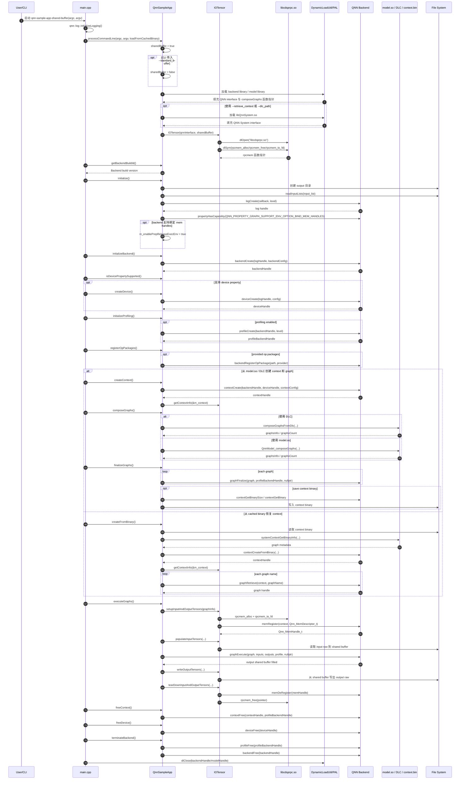
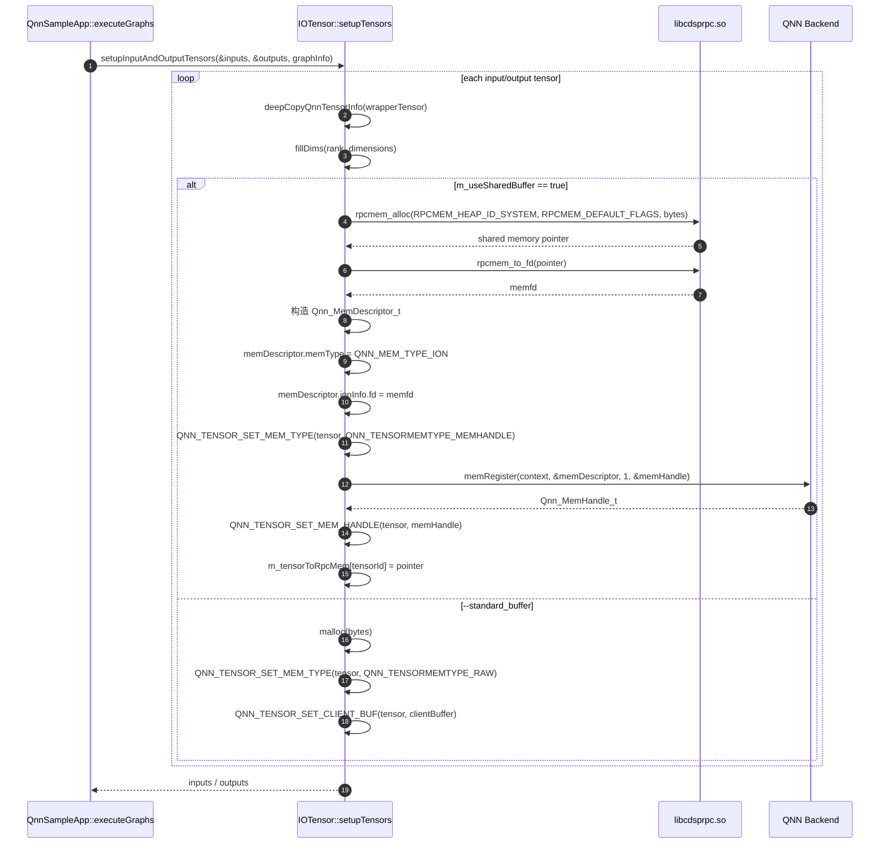
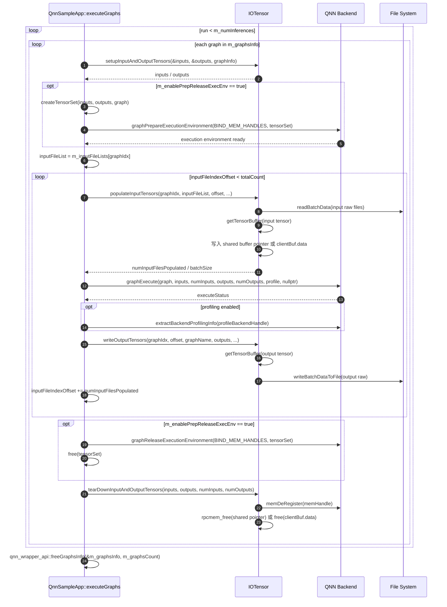
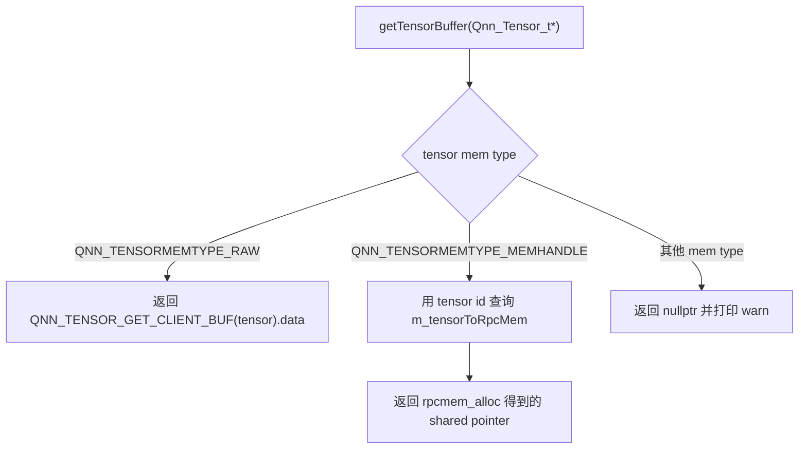

# QNN SampleAppSharedBuffer 调用时序图

本文档根据 `examples/QNN/SampleApp/SampleAppSharedBuffer/src/main.cpp`、
`examples/QNN/SampleApp/SampleAppSharedBuffer/src/QnnSampleApp.cpp` 和
`examples/QNN/SampleApp/SampleAppSharedBuffer/src/Utils/IOTensor.cpp` 梳理
`qnn-sample-app-shared-buffer` 的主要执行链路。

这个例子和普通 `SampleApp` 的主体流程基本一致，核心差异在 I/O tensor 的内存管理：

```text
普通 SampleApp:
  malloc/free
  QNN_TENSORMEMTYPE_RAW
  Qnn_ClientBuffer_t.data

SampleAppSharedBuffer 默认模式:
  rpcmem_alloc/rpcmem_free
  rpcmem_to_fd
  Qnn_MemDescriptor_t + QNN_MEM_TYPE_ION
  QNN memRegister/memDeRegister
  QNN_TENSORMEMTYPE_MEMHANDLE
```

`SampleAppSharedBuffer` 默认启用 shared buffer。只有传入 `--standard_buffer` 时，才会退回普通 non-shared buffer。

## 主流程



## Shared Buffer 创建流程

`setupInputAndOutputTensors()` 会分别为 input tensors 和 output tensors 调用 `setupTensors()`。



关键点：

| 步骤 | 作用 |
| --- | --- |
| `rpcmem_alloc` | 申请 FastRPC/ION 共享内存 |
| `rpcmem_to_fd` | 把共享内存 pointer 转成 fd |
| `Qnn_MemDescriptor_t` | 告诉 QNN backend 这块内存的维度、数据类型、内存类型和 fd |
| `memRegister` | 将这块外部共享内存注册到 QNN context，得到 `Qnn_MemHandle_t` |
| `QNN_TENSORMEMTYPE_MEMHANDLE` | tensor 不再使用 `clientBuf.data`，而是使用 QNN mem handle |
| `m_tensorToRpcMem` | SampleApp 自己保存 tensor id 到 host pointer 的映射，读写 raw 文件时仍然需要 pointer |

## executeGraphs 内部流程



`graphPrepareExecutionEnvironment()` 不是每个 backend 都一定支持。代码会先在 `initialize()` 中查询：

```text
QNN_PROPERTY_GRAPH_SUPPORT_ENV_OPTION_BIND_MEM_HANDLES
```

如果支持，执行前后会使用：

```text
graphPrepareExecutionEnvironment(... QNN_GRAPH_EXECUTE_ENVIRONMENT_OPTION_BIND_MEM_HANDLES ...)
graphReleaseExecutionEnvironment(... QNN_GRAPH_EXECUTE_ENVIRONMENT_OPTION_BIND_MEM_HANDLES ...)
```

这一步的含义是：提前把本次执行要使用的 input/output mem handles 绑定到 graph execution environment，减少执行阶段反复解析和绑定内存句柄的开销。

## getTensorBuffer 的差异

`SampleAppSharedBuffer` 仍然需要在 CPU 侧读取 input raw、写出 output raw，所以它必须能拿到真实 pointer。这个逻辑统一封装在 `IOTensor::getTensorBuffer()`：



所以 shared buffer 并不是说 CPU 侧完全碰不到数据，而是说：

```text
CPU 侧读写的是 rpcmem_alloc 返回的 pointer。
QNN backend 执行时使用的是 memRegister 返回的 Qnn_MemHandle_t。
二者指向同一块共享内存。
```

## 普通 Buffer 与 Shared Buffer 对比

| 维度 | 普通 RAW buffer | Shared buffer |
| --- | --- | --- |
| 开启方式 | 传 `--standard_buffer` | 默认行为 |
| 申请内存 | `malloc(bytes)` | `rpcmem_alloc(...)` |
| 释放内存 | `free(pointer)` | `rpcmem_free(pointer)` |
| tensor mem type | `QNN_TENSORMEMTYPE_RAW` | `QNN_TENSORMEMTYPE_MEMHANDLE` |
| QNN tensor 字段 | `Qnn_ClientBuffer_t.data` | `Qnn_MemHandle_t` |
| 是否调用 `memRegister` | 否 | 是 |
| 是否调用 `memDeRegister` | 否 | 是 |
| 依赖库 | 不依赖 `libcdsprpc.so` | 依赖 `libcdsprpc.so` |
| 适合场景 | 简单、通用、容易理解 | HTP/DSP 等需要高效共享内存的路径 |
| 对模型计算结果影响 | 不改变模型本身 | 不改变模型本身 |

一句话理解：

```text
Shared buffer 改的是 input/output tensor 的内存交付方式，不改 graph、不改 operator、不改模型数学含义。
```

## 关键函数对应关系

| 阶段 | 函数 | 主要 QNN / 工具调用 |
| --- | --- | --- |
| 参数解析 | `processCommandLine` | 解析 `--standard_buffer`，默认 `sharedBuffer = true` |
| I/O 对象构造 | `IOTensor::IOTensor` | `dlOpen("libcdsprpc.so")`、`dlSym(rpcmem_alloc/rpcmem_free/rpcmem_to_fd)` |
| 基础初始化 | `QnnSampleApp::initialize` | `readInputLists`、`logCreate`、查询 `QNN_PROPERTY_GRAPH_SUPPORT_ENV_OPTION_BIND_MEM_HANDLES` |
| Context 创建 | `createContext` / `createFromBinary` | `contextCreate` 或 `contextCreateFromBinary`，随后 `m_ioTensor.getContextInfo(&m_context)` |
| Tensor 创建 | `setupInputAndOutputTensors` | 对 input/output 调用 `setupTensors` |
| Shared buffer 注册 | `IOTensor::setupTensors` | `rpcmem_alloc`、`rpcmem_to_fd`、`memRegister`、设置 `QNN_TENSORMEMTYPE_MEMHANDLE` |
| 执行环境绑定 | `createTensorSet`、`prepareExecutionEnvironment` | `graphPrepareExecutionEnvironment(...BIND_MEM_HANDLES...)` |
| 输入填充 | `populateInputTensors` | `getTensorBuffer`，把 input raw 写入 shared pointer |
| Graph 执行 | `executeGraphs` | `graphExecute` |
| 输出写出 | `writeOutputTensors` | `getTensorBuffer`，把 shared pointer 内容写成 output raw |
| 执行环境释放 | `freeTensorSet`、`releaseExecutionEnvironment` | `graphReleaseExecutionEnvironment(...BIND_MEM_HANDLES...)` |
| Tensor 释放 | `tearDownTensors` | `memDeRegister`、`rpcmem_free` |

## 编译 SampleAppSharedBuffer

当前路径：

```text
QAIRT SDK: /home/lingbok/Qualcomm/qairt/2.47.0.260601
Example  : /home/lingbok/Qualcomm/qairt/2.47.0.260601/examples/QNN/SampleApp/SampleAppSharedBuffer
Phone dir: /data/local/tmp/qnn
```

主机端设置：

```bash
export QAIRT_SDK_ROOT=/home/lingbok/Qualcomm/qairt/2.47.0.260601
export ANDROID_NDK_ROOT=/home/lingbok/android/android-ndk-r28
export QNN_PHONE_DIR=/data/local/tmp/qnn
```

进入目录并编译 Android arm64：

```bash
cd $QAIRT_SDK_ROOT/examples/QNN/SampleApp/SampleAppSharedBuffer
make aarch64-android
```

正常产物一般在：

```text
bin/aarch64-android/qnn-sample-app-shared-buffer
```

如果最后遇到 Anaconda PATH 导致的 `find -execdir` 错误，但日志里已经出现 `Install => libs/arm64-v8a/...`，说明编译链接已经完成，可以手动收尾：

```bash
cd $QAIRT_SDK_ROOT/examples/QNN/SampleApp/SampleAppSharedBuffer

mkdir -p bin
mv libs/arm64-v8a bin/aarch64-android
rm -rf libs
```

推送到手机：

```bash
adb push bin/aarch64-android/qnn-sample-app-shared-buffer /data/local/tmp/qnn/bin/
adb shell "chmod +x /data/local/tmp/qnn/bin/qnn-sample-app-shared-buffer"
```

## 执行 Shared Buffer 模式

本例继续使用手机端已有的 MobileNet V2 HTP context binary：

```bash
adb shell '
cd /data/local/tmp/qnn

export LD_LIBRARY_PATH="$PWD/lib:$LD_LIBRARY_PATH"
export ADSP_LIBRARY_PATH="$PWD/dsp;$PWD/lib;/vendor/dsp/cdsp;/vendor/lib/rfsa/adsp;/system/lib/rfsa/adsp;/dsp"

./bin/qnn-sample-app-shared-buffer \
  --backend lib/libQnnHtp.so \
  --system_library lib/libQnnSystem.so \
  --retrieve_context mobilenet_v2/mobilenet_v2.bin \
  --input_list mobilenet_v2/input/input_list.txt \
  --output_dir mobilenet_v2/output_shared_buffer \
  --log_level info
'
```

注意：这里没有传 `--standard_buffer`，所以默认就是 shared buffer。

查看输出：

```bash
adb shell "find /data/local/tmp/qnn/mobilenet_v2/output_shared_buffer -type f"
```

预期会看到类似：

```text
/data/local/tmp/qnn/mobilenet_v2/output_shared_buffer/Result_0/class_logits.raw
```

## 对照执行 Standard Buffer 模式

同一个程序加上 `--standard_buffer`，可以强制走普通 buffer 路径，方便和 shared buffer 对照日志：

```bash
adb shell '
cd /data/local/tmp/qnn

export LD_LIBRARY_PATH="$PWD/lib:$LD_LIBRARY_PATH"
export ADSP_LIBRARY_PATH="$PWD/dsp;$PWD/lib;/vendor/dsp/cdsp;/vendor/lib/rfsa/adsp;/system/lib/rfsa/adsp;/dsp"

./bin/qnn-sample-app-shared-buffer \
  --backend lib/libQnnHtp.so \
  --system_library lib/libQnnSystem.so \
  --retrieve_context mobilenet_v2/mobilenet_v2.bin \
  --input_list mobilenet_v2/input/input_list.txt \
  --output_dir mobilenet_v2/output_standard_buffer \
  --log_level info \
  --standard_buffer
'
```

如果把 `--log_level` 改成 `verbose`，更容易看到内存路径差异：

```text
Shared buffer 模式:
  Using RPC shared buffer allocation method
  Shared buffer mode

Standard buffer 模式:
  Using normal nonshared allocation method
```

## 观察输入输出

查看 input list：

```bash
adb shell "cat /data/local/tmp/qnn/mobilenet_v2/input/input_list.txt"
```

当前内容类似：

```text
image_tensor:=/data/local/tmp/qnn/mobilenet_v2/input/image_tensor.raw
```

含义是：

```text
把 image_tensor.raw 的二进制内容填进 graph 的 image_tensor 输入 tensor。
```

在 shared buffer 模式下，这一步的实际落点是：

```text
image_tensor.raw
  -> populateInputTensors()
  -> getTensorBuffer(input tensor)
  -> m_tensorToRpcMem[tensorId]
  -> rpcmem_alloc 得到的 shared pointer
```

执行完成后输出路径是：

```text
output_shared_buffer/Result_0/class_logits.raw
```

写出时的实际来源是：

```text
QNN backend 写入 output mem handle
  -> 同一块 rpcmem shared memory
  -> getTensorBuffer(output tensor)
  -> writeBatchDataToFile()
  -> class_logits.raw
```

可以把 shared buffer 和 standard buffer 的输出拉回主机做二进制对比：

```bash
adb pull /data/local/tmp/qnn/mobilenet_v2/output_shared_buffer/Result_0/class_logits.raw /tmp/class_logits_shared.raw
adb pull /data/local/tmp/qnn/mobilenet_v2/output_standard_buffer/Result_0/class_logits.raw /tmp/class_logits_standard.raw

cmp /tmp/class_logits_shared.raw /tmp/class_logits_standard.raw
```

如果模型、输入、backend 都相同，两个输出通常应一致。即使存在少量浮点差异，也应该非常小；shared buffer 的目标是减少数据交付开销，不是改变结果。

## 常见问题

### 找不到 libcdsprpc.so

如果日志出现：

```text
Unable to load backend. dlerror(): libcdsprpc.so ...
```

先检查手机端是否有这个库，并确认 `LD_LIBRARY_PATH` 包含 `/data/local/tmp/qnn/lib`：

```bash
adb shell "ls /data/local/tmp/qnn/lib/libcdsprpc.so"
adb shell "cd /data/local/tmp/qnn && LD_LIBRARY_PATH=$PWD/lib:$LD_LIBRARY_PATH ./bin/qnn-sample-app-shared-buffer --help"
```

### memRegister 失败

如果日志出现：

```text
Failure to register ion memory with the backend
```

重点检查：

| 检查项 | 说明 |
| --- | --- |
| backend | HTP/DSP 这类路径更需要 shared buffer；CPU backend 未必接受同样的 ION mem descriptor |
| fd | `rpcmem_to_fd(pointer)` 不能返回 `-1` |
| tensor metadata | rank、dimensions、data type 必须和 graph metadata 一致 |
| context | `m_ioTensor.getContextInfo(&m_context)` 必须在 context 创建后调用 |
| 库路径 | `libcdsprpc.so`、HTP skeleton、DSP 相关路径需要都能找到 |

### graphPrepareExecutionEnvironment 不一定执行

`SampleAppSharedBuffer` 会先查询：

```text
QNN_PROPERTY_GRAPH_SUPPORT_ENV_OPTION_BIND_MEM_HANDLES
```

只有 backend 支持时才会设置 `m_enablePrepReleaseExecEnv = true`，并调用：

```text
graphPrepareExecutionEnvironment
graphReleaseExecutionEnvironment
```

所以 shared buffer 的基本路径是 `rpcmem + memRegister + MEMHANDLE tensor`；执行环境绑定是进一步优化，不是每次都一定出现。

## 当前链路总结

```text
mobilenet_v2.bin
  定义 graph:
    input : image_tensor
    output: class_logits

input_list.txt
  指定:
    image_tensor <- image_tensor.raw

qnn-sample-app-shared-buffer 默认执行:
  contextCreateFromBinary()
  graphRetrieve()
  rpcmem_alloc()
  rpcmem_to_fd()
  memRegister()
  QNN_TENSORMEMTYPE_MEMHANDLE
  graphExecute()
  write output raw
  memDeRegister()
  rpcmem_free()

output_shared_buffer
  得到:
    class_logits.raw
```

最重要的理解点：

```text
SampleAppSharedBuffer 学的是 QNN tensor I/O buffer 的内存注册与共享方式。
它不是多 graph 示例，也不是自定义 op 示例。
它的价值在于理解 HTP/DSP 场景下 input/output 如何通过 mem handle 交给 backend。
```
