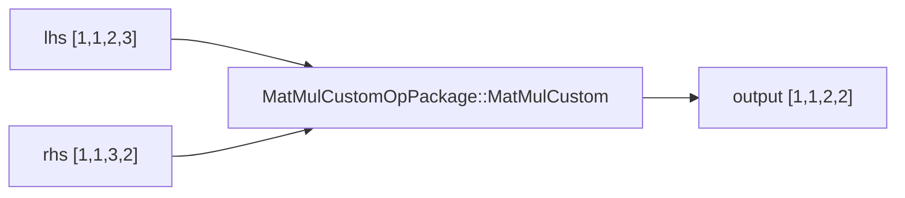

# QNN HTP Custom MatMul 实验记录

本文记录使用 QAIRT/QNN 2.47，从零定义一个 `MatMulCustom` Op Package，在 Snapdragon 8 Gen 3 手机的 HTP 上执行，并使用 NumPy 验证结果的完整过程。

本实验的目标是理解 HTP Custom Op Package 的完整开发链，而不是实现高性能矩阵乘法。

最终状态：

```text
XML 定义通过
HTP Op Package 生成成功
Hexagon v75 执行库编译成功
ARM64 Prepare 库编译成功
Model Library 编译成功
真机 HTP Graph Finalize 成功
真机 HTP Graph Execute 成功
输出与 NumPy 一致
```

当前实现运行在 HTP/CDSP，但没有使用 HMX：

```text
runlist = ... + 2 vec + 0 mtx
```

## 1. 实验环境

```text
Repository      : ~/Cross-Backend_LLM_Inference_on_SnapDragon
QAIRT SDK       : /home/lingbok/Qualcomm/qairt/2.47.0.260601
QAIRT version   : 2.47.0.260601
Python          : Conda qairt-2.47 / Python 3.12
Android NDK     : /home/lingbok/android/android-ndk-r28
Hexagon SDK     : /local/mnt/workspace/Qualcomm/Hexagon_SDK/5.5.5.0
Hexagon Tools   : 8.7.06
Hexagon target  : v75
Phone SoC       : SM8650 / Snapdragon 8 Gen 3
Backend         : libQnnHtp.so
Phone root      : /data/local/tmp/qnn
```

环境变量：

```bash
export REPO="$HOME/Cross-Backend_LLM_Inference_on_SnapDragon"

export QAIRT_SDK_ROOT=/home/lingbok/Qualcomm/qairt/2.47.0.260601
export QNN_SDK_ROOT="$QAIRT_SDK_ROOT"
export ANDROID_NDK_ROOT=/home/lingbok/android/android-ndk-r28

export SDK555=/local/mnt/workspace/Qualcomm/Hexagon_SDK/5.5.5.0
export HEXAGON_SDK_ROOT="$SDK555"
export HEXAGON_TOOLS_ROOT="$SDK555/tools/HEXAGON_Tools/8.7.06"

export PYTHONPATH="$QAIRT_SDK_ROOT/lib/python"
export LD_LIBRARY_PATH="$CONDA_PREFIX/lib:$QAIRT_SDK_ROOT/lib/x86_64-linux-clang:$LD_LIBRARY_PATH"
export PATH="$QAIRT_SDK_ROOT/bin/x86_64-linux-clang:$ANDROID_NDK_ROOT:$PATH"
```

## 2. 工程结构

```text
qnn_custom_ops/matmul/
├── README.md
├── config/
│   └── MatMulCustomOpPackageHtp.xml
├── htp/
│   └── MatMulCustomOpPackage/
│       ├── Makefile
│       ├── config/
│       └── src/
│           ├── MatMulCustomOpPackageInterface.cpp
│           └── ops/MatMulCustom.cpp
├── model/
│   └── custom_matmul_htp_model.cpp
├── model_libs/
│   └── aarch64-android/libcustom_matmul_htp_model.so
├── scripts/
│   └── generate_inputs.py
├── test_data/
│   ├── lhs.raw
│   ├── rhs.raw
│   └── expected.raw
└── device_output/
    └── Result_0/output.raw
```

`build/`、`model_libs/`、`device_output/` 和二进制 `.raw` 是生成产物，不应默认提交到 Git。

## 3. 算子定义

为了避免与 QNN 内置 `qti.aisw::MatMul` 冲突，本实验使用独立名称：

```text
PackageName = MatMulCustomOpPackage
OpName      = MatMulCustom
Backend     = HTP
Datatype    = QNN_DATATYPE_FLOAT_32
Inputs      = lhs、rhs
Output      = output
Params      = 0
```

第一版只支持四维 batch MatMul：

```text
lhs    [B, H, M, K]
rhs    [B, H, K, N]
output [B, H, M, N]
```

数学公式：

```text
output[b,h,m,n]
  = sum(lhs[b,h,m,k] * rhs[b,h,k,n])
      k
```

第一版不支持：

- Batch broadcast。
- Transpose。
- Bias。
- FP16。
- INT8/INT16。
- 量化 scale/offset。
- 动态 rank。
- HMX kernel。

## 4. XML 接口契约

配置文件：

```text
config/MatMulCustomOpPackageHtp.xml
```

核心结构：

```xml
<OpDefCollection
        PackageName="MatMulCustomOpPackage"
        Domain="aisw"
        Version="1.0">
    <OpDefList>
        <OpDef>
            <Name>MatMulCustom</Name>

            <Input>
                <Name>lhs</Name>
                <Mandatory>true</Mandatory>
                <Datatype>BACKEND_SPECIFIC</Datatype>
                <Shape>
                    <Rank>4D</Rank>
                    <Text>[batch, head, rows, reduction]</Text>
                </Shape>
            </Input>

            <Input>
                <Name>rhs</Name>
                <Mandatory>true</Mandatory>
                <Datatype>BACKEND_SPECIFIC</Datatype>
                <Shape>
                    <Rank>4D</Rank>
                    <Text>[batch, head, reduction, columns]</Text>
                </Shape>
            </Input>

            <Output>
                <Name>output</Name>
                <Mandatory>true</Mandatory>
                <Datatype>BACKEND_SPECIFIC</Datatype>
                <Shape>
                    <Rank>4D</Rank>
                    <Text>[batch, head, rows, columns]</Text>
                </Shape>
            </Output>

            <SupportedBackend>HTP</SupportedBackend>
        </OpDef>
    </OpDefList>
</OpDefCollection>
```

Supplemental HTP 定义中，两个输入和一个输出都只声明：

```xml
<Datatype>QNN_DATATYPE_FLOAT_32</Datatype>
```

XML 描述公开接口，但不会自动校验：

```text
lhs.B == rhs.B
lhs.H == rhs.H
lhs.K == rhs.K
output.M == lhs.M
output.N == rhs.N
```

这些 shape 关系由当前 kernel 在运行时检查。

## 5. 生成 HTP Op Package

```bash
conda activate qairt-2.47

qnn-op-package-generator \
  --config_path "$REPO/qnn_custom_ops/matmul/config/MatMulCustomOpPackageHtp.xml" \
  --output_path "$REPO/qnn_custom_ops/matmul/htp" \
  --debug
```

生成：

```text
htp/MatMulCustomOpPackage/
├── Makefile
├── config/MatMulCustomOpPackageHtp.xml
└── src
    ├── MatMulCustomOpPackageInterface.cpp
    └── ops/MatMulCustom.cpp
```

导出入口：

```text
MatMulCustomOpPackageInterfaceProvider
```

生成的 Interface 校验：

```cpp
if (std::string(opConfig.v1.typeName) == "MatMulCustom") {
  if (opConfig.v1.numOfParams != 0 ||
      opConfig.v1.numOfInputs != 2 ||
      opConfig.v1.numOfOutputs != 1) {
    return QNN_OP_PACKAGE_ERROR_VALIDATION_FAILURE;
  }
}
```

## 6. 注册 FLOAT32 Implementation

文件：

```text
htp/MatMulCustomOpPackage/src/ops/MatMulCustom.cpp
```

生成器提供通用注册：

```cpp
DEF_PACKAGE_OP((matmulcustomImpl<Tensor>), "MatMulCustom")
```

本实验增加 FLOAT32 `PlainFloatTensor` 注册：

```cpp
DEF_PACKAGE_OP_AND_COST_AND_FLAGS(
    (matmulcustomImpl<PlainFloatTensor>),
    "MatMulCustom",
    SNAIL)
```

没有注册 `Flags::RESOURCE_HMX`。当前 legacy external HTP Op Package 不支持使用该 flag 请求 HMX resource。

## 7. 实现 MatMul Kernel

函数签名：

```cpp
template <typename TensorType>
GraphStatus matmulcustomImpl(TensorType& out_0,
                             const TensorType& lhs,
                             const TensorType& rhs);
```

HTP implementation 参数顺序是输出在前、输入在后：

```text
out_0
lhs
rhs
```

实现：

```cpp
template <typename TensorType>
GraphStatus matmulcustomImpl(TensorType& out_0,
                             const TensorType& lhs,
                             const TensorType& rhs) {
  if (lhs.dim(0) != rhs.dim(0) ||
      lhs.dim(1) != rhs.dim(1) ||
      lhs.dim(3) != rhs.dim(2)) {
    return GraphStatus::ErrorFatal;
  }

  const Idx batches = lhs.dim(0);
  const Idx heads   = lhs.dim(1);
  const Idx rows    = lhs.dim(2);
  const Idx depth   = lhs.dim(3);
  const Idx columns = rhs.dim(3);

  size_t outputDimensions[4] = {
      static_cast<size_t>(batches),
      static_cast<size_t>(heads),
      static_cast<size_t>(rows),
      static_cast<size_t>(columns),
  };

  out_0.set_dims(outputDimensions);

  for (Idx b = 0; b < batches; ++b) {
    for (Idx h = 0; h < heads; ++h) {
      for (Idx m = 0; m < rows; ++m) {
        for (Idx n = 0; n < columns; ++n) {
          float accumulator = 0.0f;

          for (Idx k = 0; k < depth; ++k) {
            accumulator +=
                lhs(b, h, m, k) * rhs(b, h, k, n);
          }

          out_0(b, h, m, n) = accumulator;
        }
      }
    }
  }

  return GraphStatus::Success;
}
```

循环含义：

```text
b  batch
h  head
m  lhs/output 行
n  rhs/output 列
k  reduction 维度
```

时间复杂度：

```text
O(B * H * M * N * K)
```

当前实现没有动态堆内存分配，符合 HTP execute function 的基本要求。

## 8. 编译 Hexagon v75 执行库

```bash
cd "$REPO/qnn_custom_ops/matmul/htp/MatMulCustomOpPackage"

make htp_v75 \
  QNN_INCLUDE="$QNN_SDK_ROOT/include/QNN" \
  HEXAGON_SDK_ROOT="$SDK555" \
  HEXAGON_SDK_ROOT_V75="$SDK555" \
  HEXAGON_SDK_ROOT_X86="$SDK555" \
  HEXAGON_TOOLS_VERSION_V75=8.7.06 \
  HEXAGON_TOOLS_VERSION_X86=8.7.06
```

产物：

```text
build/hexagon-v75/libQnnMatMulCustomOpPackage.so
```

实际检查结果：

```text
ELF 32-bit LSB shared object, QUALCOMM DSP6
Size: 59 KB
Export: MatMulCustomOpPackageInterfaceProvider
```

编译参数包含 `-mhmx`，但这只启用编译目标特性，不表示当前 C++ 循环使用了 HMX。

## 9. 编译 ARM64 Prepare 库

```bash
make htp_aarch64 \
  QNN_INCLUDE="$QNN_SDK_ROOT/include/QNN" \
  QNN_TARGET_LIB="$QNN_SDK_ROOT/lib/aarch64-android" \
  ANDROID_NDK_ROOT="$ANDROID_NDK_ROOT" \
  HEXAGON_SDK_ROOT="$SDK555" \
  HEXAGON_SDK_ROOT_X86="$SDK555" \
  HEXAGON_TOOLS_VERSION_X86=8.7.06
```

产物：

```text
build/aarch64-android/libQnnMatMulCustomOpPackage.so
```

实际检查结果：

```text
ELF 64-bit LSB shared object, ARM aarch64
Size: 1.5 MB
Export: MatMulCustomOpPackageInterfaceProvider
NEEDED: libQnnHtp.so
NEEDED: libQnnHtpPrepare.so
```

两份库职责：

```text
aarch64-android  ARM 侧 Package 注册、校验和在线 Prepare
hexagon-v75      CDSP/HTP 侧执行 matmulcustomImpl()
```

## 10. 构造测试 Graph

模型文件：

```text
model/custom_matmul_htp_model.cpp
```

Graph：



Graph 名：

```text
customMatMulHtpGraph
```

输入 Tensor：

```text
lhs  QNN_TENSOR_TYPE_APP_WRITE  FLOAT32  [1,1,2,3]
rhs  QNN_TENSOR_TYPE_APP_WRITE  FLOAT32  [1,1,3,2]
```

输出 Tensor：

```text
output  QNN_TENSOR_TYPE_APP_READ  FLOAT32  [1,1,2,2]
```

Node：

```cpp
customMatMulModel.addNode(
    QNN_OPCONFIG_VERSION_1,
    "MatMulCustom_0",
    "MatMulCustomOpPackage",
    "MatMulCustom",
    nullptr,
    0,
    inputNames,
    2,
    outputs,
    1);
```

模型库必须导出：

```text
QnnModel_composeGraphs
QnnModel_freeGraphsInfo
```

## 11. 编译 Model Library

```bash
qnn-model-lib-generator \
  -c "$REPO/qnn_custom_ops/matmul/model/custom_matmul_htp_model.cpp" \
  -t aarch64-android \
  -l custom_matmul_htp_model \
  -o "$REPO/qnn_custom_ops/matmul/model_libs"
```

产物：

```text
model_libs/aarch64-android/libcustom_matmul_htp_model.so
```

实际检查结果：

```text
ELF 64-bit LSB shared object, ARM aarch64
Size: 343 KB
Export: QnnModel_composeGraphs
Export: QnnModel_freeGraphsInfo
```

## 12. 生成输入与参考结果

测试矩阵：

```text
A = [[1, 2, 3],
     [4, 5, 6]]

B = [[ 7,  8],
     [ 9, 10],
     [11, 12]]

C = A * B
  = [[ 58,  64],
     [139, 154]]
```

生成脚本：

```bash
python3 "$REPO/qnn_custom_ops/matmul/scripts/generate_inputs.py"
```

文件大小：

```text
lhs.raw       24 bytes  6 * float32
rhs.raw       24 bytes  6 * float32
expected.raw  16 bytes  4 * float32
```

## 13. 部署到手机

```bash
export MATMUL_ROOT="$REPO/qnn_custom_ops/matmul"
export MATMUL_PKG="$MATMUL_ROOT/htp/MatMulCustomOpPackage"
```

创建目录：

```bash
adb shell '
rm -rf /data/local/tmp/qnn/custom_matmul_htp
mkdir -p /data/local/tmp/qnn/custom_matmul_htp/lib
mkdir -p /data/local/tmp/qnn/custom_matmul_htp/dsp
mkdir -p /data/local/tmp/qnn/custom_matmul_htp/input
mkdir -p /data/local/tmp/qnn/custom_matmul_htp/output
'
```

推送 Model Library：

```bash
adb push \
  "$MATMUL_ROOT/model_libs/aarch64-android/libcustom_matmul_htp_model.so" \
  /data/local/tmp/qnn/custom_matmul_htp/lib/
```

推送 ARM64 Prepare Package：

```bash
adb push \
  "$MATMUL_PKG/build/aarch64-android/libQnnMatMulCustomOpPackage.so" \
  /data/local/tmp/qnn/custom_matmul_htp/lib/libQnnMatMulCustomOpPackage_Cpu.so
```

推送 Hexagon v75 Package：

```bash
adb push \
  "$MATMUL_PKG/build/hexagon-v75/libQnnMatMulCustomOpPackage.so" \
  /data/local/tmp/qnn/custom_matmul_htp/dsp/libQnnMatMulCustomOpPackage_Htp.so
```

推送输入：

```bash
adb push \
  "$MATMUL_ROOT/test_data/lhs.raw" \
  "$MATMUL_ROOT/test_data/rhs.raw" \
  /data/local/tmp/qnn/custom_matmul_htp/input/
```

双输入必须写在 `input_list.txt` 的同一行：

```bash
adb shell 'printf "%s\n" \
"lhs:=/data/local/tmp/qnn/custom_matmul_htp/input/lhs.raw rhs:=/data/local/tmp/qnn/custom_matmul_htp/input/rhs.raw" \
> /data/local/tmp/qnn/custom_matmul_htp/input/input_list.txt'
```

## 14. 真机执行

```bash
adb shell '
cd /data/local/tmp/qnn

export LD_LIBRARY_PATH="$PWD/custom_matmul_htp/lib:$PWD/lib:$LD_LIBRARY_PATH"
export ADSP_LIBRARY_PATH="$PWD/custom_matmul_htp/dsp;$PWD/dsp;$PWD/lib;/vendor/dsp/cdsp;/vendor/lib/rfsa/adsp;/system/lib/rfsa/adsp;/dsp"

rm -rf custom_matmul_htp/output

./bin/qnn-sample-app \
  --backend lib/libQnnHtp.so \
  --model custom_matmul_htp/lib/libcustom_matmul_htp_model.so \
  --op_packages custom_matmul_htp/lib/libQnnMatMulCustomOpPackage_Cpu.so:MatMulCustomOpPackageInterfaceProvider:CPU,libQnnMatMulCustomOpPackage_Htp.so:MatMulCustomOpPackageInterfaceProvider:HTP \
  --input_list custom_matmul_htp/input/input_list.txt \
  --output_dir custom_matmul_htp/output \
  --input_data_type float \
  --output_data_type float_only \
  --log_level info
'
```

## 15. 运行日志解析

ARM64 Prepare Package 加载成功：

```text
Loaded package MatMulCustomOpPackage from file
libQnnMatMulCustomOpPackage_Cpu.so
```

两份 Package 注册成功：

```text
Registered Op Package: ..._Cpu.so
Registered Op Package: libQnnMatMulCustomOpPackage_Htp.so
```

三个 Tensor 创建成功：

```text
QnnTensor_createGraphTensor done
QnnTensor_createGraphTensor done
QnnTensor_createGraphTensor done
```

Node 校验和添加成功：

```text
QnnBackend_validateOpConfig done successfully
QnnGraph_addNode done. status 0x0
```

HTP Prepare 成功：

```text
QnnGraph_finalize done. status 0x0
```

HTP 执行成功：

```text
Graph customMatMulHtpGraph execution finished with result 0
QnnGraph_execute done. status 0x0
```

资源统计：

```text
runlist = 17 + 2 vec + 0 mtx + 0 elt + 0 non-run
```

解释：

```text
vec = 2  Prepared runlist 中存在 vector 资源工作
mtx = 0  没有使用 HMX matrix resource
```

`vec = 2` 不能单独证明手写的内层乘加循环已经得到理想的 HVX 向量化；需要反汇编或 profiling 进一步验证。

## 16. 验证输出

```bash
rm -rf "$MATMUL_ROOT/device_output"

adb pull \
  /data/local/tmp/qnn/custom_matmul_htp/output \
  "$MATMUL_ROOT/device_output"
```

```python
from pathlib import Path
import numpy as np

root = Path.home() / "Cross-Backend_LLM_Inference_on_SnapDragon/qnn_custom_ops/matmul"

expected = np.fromfile(
    root / "test_data/expected.raw",
    dtype=np.float32,
).reshape(1, 1, 2, 2)

output_file = next((root / "device_output").rglob("*.raw"))

actual = np.fromfile(
    output_file,
    dtype=np.float32,
).reshape(1, 1, 2, 2)

print("expected:")
print(expected)
print("actual:")
print(actual)
print("match:", np.allclose(actual, expected))
```

最终结果：

```text
expected:
[[[[ 58.  64.]
   [139. 154.]]]]

actual:
[[[[ 58.  64.]
   [139. 154.]]]]

match: True
```

## 17. 完整函数链

```text
qnn-sample-app
  -> dlopen(libQnnHtp.so)
  -> QnnBackend_create()
  -> QnnDevice_create()
  -> register ARM64 Package, target=CPU
       -> MatMulCustomOpPackageInterfaceProvider()
       -> MatMulCustomOpPackageInit()
       -> MatMulCustomOpPackageGetInfo()
  -> register Hexagon Package, target=HTP
       -> CDSP 加载 libQnnMatMulCustomOpPackage_Htp.so
       -> op_pkg_init()
       -> REGISTER_PACKAGE_OPS()
  -> QnnContext_create()
  -> dlopen(libcustom_matmul_htp_model.so)
  -> QnnModel_composeGraphs()
       -> QnnGraph_create(customMatMulHtpGraph)
       -> 创建 lhs Tensor
       -> 创建 rhs Tensor
       -> 创建 output Tensor
       -> QnnGraph_addNode(MatMulCustomOpPackage::MatMulCustom)
  -> MatMulCustomOpPackageValidateOpConfig()
  -> QnnGraph_finalize()
       -> 匹配 matmulcustomImpl<PlainFloatTensor>()
       -> layout、VTCM、DMA、内存和 runlist 准备
  -> QnnGraph_execute()
       -> matmulcustomImpl(output, lhs, rhs)
       -> 五层循环完成矩阵乘法
  -> 写出 output.raw
```

## 18. 当前实现的边界

当前代码用于学习完整链路，不适合作为高性能产品 kernel：

- 仅支持 FLOAT32。
- 仅支持 rank 4。
- 不支持 batch/head broadcast。
- 不支持 transpose。
- 没有 blocking/tiling。
- 没有显式 HVX intrinsic。
- 没有专用 VTCM implementation。
- 没有使用 HMX。
- 没有针对 cache 或 rhs layout 优化访问。
- 只验证了 `[1,1,2,3] * [1,1,3,2]`。
- `ValidateOpConfig()` 只检查输入输出数量，未检查完整 shape 关系。

## 19. HMX 限制

当前 legacy HTP external Op Package 的示例明确注明：

```text
RESOURCE_HMX not supported in external op packages
```

因此不能简单增加：

```cpp
Flags::RESOURCE_HMX
```

`Makefile` 中存在 `-mhmx` 也不表示 kernel 自动使用 HMX。

QAIRT 2.47 的 QHPI API 定义了：

```text
QHPI_RESOURCE_MAIN
QHPI_RESOURCE_HVX
QHPI_RESOURCE_HMX
```

但 QHPI HMX kernel 仍涉及平台支持、HMX layout、VTCM tiling、资源调度和可用 API，不能仅靠 resource flag 完成矩阵乘法。

## 20. 后续优化路线

建议按以下顺序继续：

```text
1. 增加多组 shape 正确性测试
2. 补充更严格的 shape validation
3. 调整 rhs 访问或预转置，改善连续内存访问
4. 实现 cache-friendly blocking
5. 研究 PlainFloatTensor_TCM 和 VTCM tiling
6. 实现并验证 HVX vector kernel
7. 使用 profiling 对比标量/HVX 版本
8. 学习 QHPI kernel 注册模型
9. 研究目标平台对 QHPI_RESOURCE_HMX 的实际支持
10. 对比 QNN 内置 qti.aisw::MatMul 的性能
```

## 21. Git 注意事项

建议提交：

```text
README.md
config/MatMulCustomOpPackageHtp.xml
src/ops/MatMulCustom.cpp
model/custom_matmul_htp_model.cpp
scripts/generate_inputs.py
必要的生成工程文件
```

建议忽略：

```gitignore
qnn_custom_ops/**/build/
qnn_custom_ops/**/obj/
qnn_custom_ops/**/libs/
qnn_custom_ops/**/model_libs/
qnn_custom_ops/**/device_output/
qnn_custom_ops/**/*.so
qnn_custom_ops/**/*.o
```

公开上传前，需要检查 QAIRT 生成文件中的 Qualcomm proprietary/confidential 声明以及 SDK 许可，不要提交 SDK 自带 headers、工具或预编译库。

## 22. 结论

本实验已经证明：

```text
自定义 XML
  -> HTP Package 代码生成
  -> 自定义 FLOAT32 MatMul kernel
  -> ARM64/Hexagon 双 Package 编译
  -> 自定义 Model Graph
  -> Android HTP 在线 Prepare
  -> CDSP 执行
  -> NumPy 数值验证通过
```

当前实现是一个真正运行在 QNN HTP Graph 中的自定义矩阵乘法，但仍是正确性优先的基础版本。下一阶段的重点不再是“能不能运行”，而是理解 Tensor layout、HVX、VTCM、tiling 和 profiling 如何将它变成高效实现。
