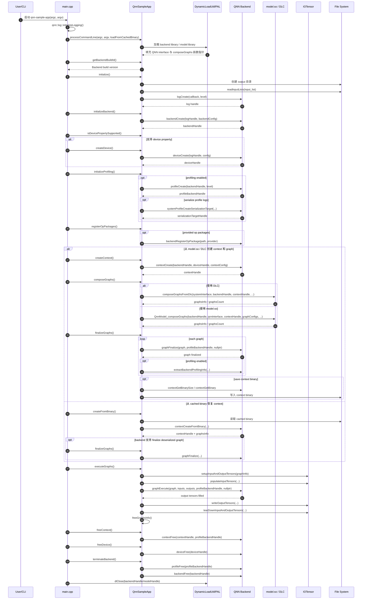
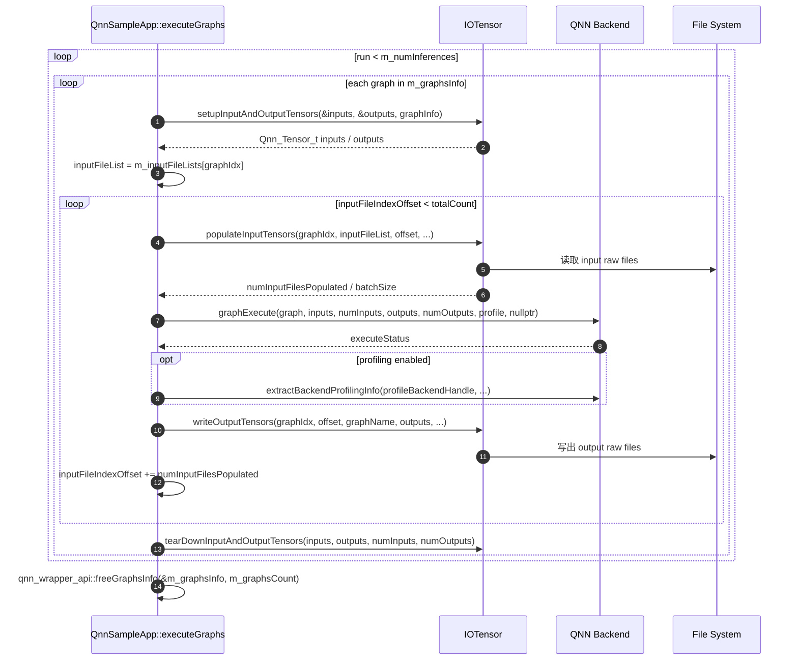

# QNN SampleApp 调用时序图

本文档根据 `examples/QNN/SampleApp/SampleApp/src/main.cpp` 和
`examples/QNN/SampleApp/SampleApp/src/QnnSampleApp.cpp` 梳理
`qnn-sample-app` 的主要执行链路。

## 主流程

## executeGraphs 内部流程

## 关键函数对应关系

| 阶段 | SampleApp 函数 | 主要 QNN / 工具调用 |
| --- | --- | --- |
| 参数解析与动态库加载 | `processCommandLine` | 加载 backend/model library，解析命令行参数 |
| 基础初始化 | `QnnSampleApp::initialize` | `readInputLists`、`logCreate` |
| Backend 初始化 | `QnnSampleApp::initializeBackend` | `backendCreate` |
| Device 创建 | `QnnSampleApp::createDevice` | `deviceCreate` |
| Profiling 初始化 | `QnnSampleApp::initializeProfiling` | `profileCreate`、`systemProfileCreateSerializationTarget` |
| Context 创建 | `QnnSampleApp::createContext` | `contextCreate` |
| Graph 组成 | `QnnSampleApp::composeGraphs` | `QnnModel_composeGraphs` 或 `composeGraphsFromDlc` |
| Graph finalize | `QnnSampleApp::finalizeGraphs` | `graphFinalize`，可选 `saveBinary` |
| Cached binary 恢复 | `QnnSampleApp::createFromBinary` | 从 context binary 创建 context 和 graph |
| Graph 执行 | `QnnSampleApp::executeGraphs` | `setupInputAndOutputTensors`、`populateInputTensors`、`graphExecute`、`writeOutputTensors` |
| 资源释放 | `freeContext`、`freeDevice`、`terminateBackend` | `contextFree`、`deviceFree`、`profileFree`、`backendFree` |

## 阅读提示

- `main.cpp` 控制整体顺序，并在每一步失败时通过 `reportError` 记录错误。
- `QnnSampleApp.cpp` 把 QNN C API 包装成 SampleApp 的成员函数。
- 非 cached binary 路径是 `createContext -> composeGraphs -> finalizeGraphs -> executeGraphs`。
- cached binary 路径是 `createFromBinary -> 可选 finalizeGraphs -> executeGraphs`。
- `executeGraphs` 会在函数末尾调用 `freeGraphsInfo`，而 `freeContext` 负责释放 context 以及残留的 graph/tensor 元数据。
